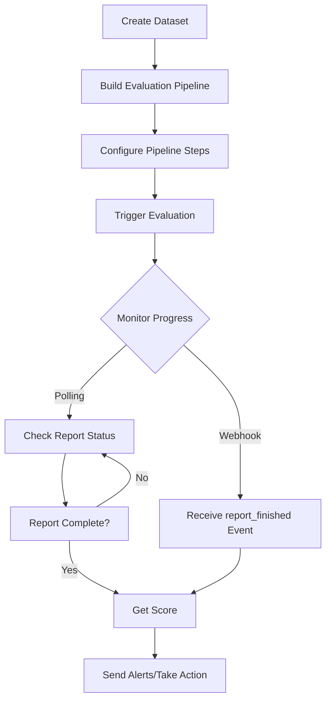

PromptLayer offers powerful options for configuring and running evaluation pipelines programmatically in your workflows. This is ideal for users who require the flexibility to run evaluations from code, enabling seamless integration with existing CI/CD pipelines or custom automation scripts.

## Recommended Workflow

We recommend a systematic approach to implementing automated evaluations:



This approach enables two powerful use cases:

### 1. Nightly Evaluations (Production Monitoring)

Run scheduled evaluations to ensure nothing has changed in your production system. The score can be sent to Slack or your alerting system with a direct link to the evaluation pipeline. This helps detect production issues by sampling a wide range of requests and comparing against expected performance.

### 2. CI/CD Integration

Trigger evaluations in your CI/CD pipeline (GitHub, GitLab, etc.) whenever relevant PRs are created. Wait for the evaluation score before proceeding with deployment, to make sure that your changes do not break anything.

## Step-by-Step Implementation

### Step 1: Create a Dataset

To run evaluations, you'll need a dataset against which to test your prompts. PromptLayer now provides a comprehensive set of APIs for dataset management:

#### 1.1 Create a Dataset Group

First, create a dataset group to organize your datasets:

- **Endpoint**: `POST /api/public/v2/dataset-groups`
- **Description**: Create a new dataset group within a workspace
- **Authentication**: JWT or API key
- **Docs Link**: [Create Dataset Group](../../reference/create-dataset-group)

```json
{
  "name": "Production Evaluation Datasets",
  "workspace_id": 32
}
```

#### 1.2 Create a Dataset Version

Once you have a dataset group, you can create dataset versions using two methods:

##### Option A: From Request History

Create a dataset from your existing request logs:

- **Endpoint**: `POST /api/public/v2/dataset-versions/from-filter-params`
- **Description**: Create a dataset version by filtering request logs
- **Authentication**: API key only
- **Docs Link**: [Create Dataset Version from Filter Params](../../reference/create-dataset-version-from-filter-params)

```json
{
  "dataset_group_id": 123,
  "tags": ["prod"],
  "metadata": {
    "environment": "production"
  },
  "prompt_id": 456,
  "start_time": "2024-01-01T00:00:00Z",
  "end_time": "2024-01-31T23:59:59Z"
}
```

##### Option B: From File Upload

Upload a CSV or JSON file to create a dataset:

- **Endpoint**: `POST /api/public/v2/dataset-versions/from-file`
- **Description**: Create a dataset version by uploading a file
- **Authentication**: API key only
- **Docs Link**: [Create Dataset Version from File](../../reference/create-dataset-version-from-file)

```json
{
  "dataset_group_id": 123,
  "file_name": "test_cases.csv",
  "file_content_base64": "aW5wdXQsZXhwZWN0ZWRfb3V0cHV0LHNjb3JlCiJIZWxsbyIsIldvcmxkIiwxLjAK..."
}
```

### Step 2: Create an Evaluation Pipeline

We highly reccomend building an evaluation pipeline via our dashboard. You can still create your evaluation pipeline (report) by making a POST request to `/reports` with a name and dataset ID.
But this method is less user-friendly and does not provide the same level of configuration options as the dashboard.

#### Example Payload

```json
{
  "name": "Nightly Production Evaluation",
  "test_dataset_id": 123
}
```

### Step 3: Configure Pipeline Steps

The evaluation pipeline consists of steps, each referred to as a "report column". Configure these by making POST requests to `/report-columns` for each desired step.

#### Example: Prompt Template Step

```json
{
    "column_type": "PROMPT_TEMPLATE",
    "name": "prompt response",
    "configuration": {
        "engine": {
            "provider": "openai",
            "model": "gpt-4",
            "parameters": {
                "temperature": 0.1,
                "max_tokens": 512
            }
        },
        "template": {
            "name": "my_prompt_template",
            "version_number": null
        },
        "prompt_template_variable_mappings": {
            "query": "variable.query",
            "context": "variable.context"
        }
    },
    "report_id": report_id
}
```

#### Example: API Endpoint Step

```json
{
    "column_type": "ENDPOINT",
    "name": "RAG-Enhancement",
    "configuration": {
        "url": "https://api.example.com/enhance"
    },
    "report_id": report_id
}
```

### Step 4: Trigger the Evaluation

Once your pipeline is configured, trigger it programmatically using the run endpoint:

- **Endpoint**: `POST /reports/{report_id}/run`
- **Description**: Execute the evaluation pipeline with optional dataset refresh
- **Docs Link**: [Run Evaluation Pipeline](../../reference/run-report)

#### Example Payload

```json
{
  "name": "Nightly Eval - 2024-12-15",
  "dataset_id": 123
}
```

### Step 5: Monitor and Retrieve Results

You have two options for monitoring evaluation progress:

#### Option A: Polling

Continuously check the report status until completion:

- **Endpoint**: `GET /reports/{report_id}`
- **Description**: Retrieve the status and results of a specific report by its ID.
- **Docs Link**: [Get Report Status](../../reference/get-report)

```bash
# Response includes status: "RUNNING" or "COMPLETED"
{
    "success": true,
    "report": {...},
    "status": "COMPLETED",
    "stats": {
        "status_counts": {
            "COMPLETED": 95,
            "FAILED": 3,
            "QUEUED": 0,
            "RUNNING": 2
        }
    }
}
```

#### Option B: Webhooks

Listen for the `report_finished` webhook event for real-time notifications when evaluations complete.

### Step 6: Get the Score

Once the evaluation is complete, retrieve the final score:

- **Endpoint**: `GET /reports/{report_id}/score`
- **Description**: Fetch the score of a specific report by its ID.
- **Docs Link**: [Get Evaluation Score](../../reference/get-report-score)

#### Example Response

```json
{
  "success": true,
  "message": "success",
  "score": {
    "overall_score": 87.5,
    "score_type": "multi_column",
    "has_custom_scoring": false,
    "details": {
      "columns": [
        {
          "column_name": "Accuracy Check",
          "score": 90.0,
          "score_type": "boolean"
        },
        {
          "column_name": "Safety Check",
          "score": 85.0,
          "score_type": "boolean"
        }
      ]
    }
  }
}
```
