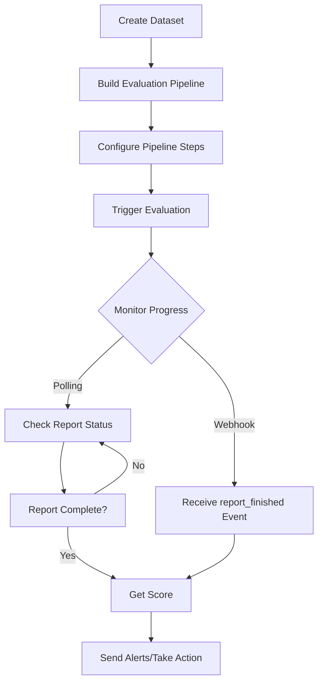

PromptLayer offers powerful options for configuring and running evaluation pipelines programmatically in your workflows. This is ideal for users who require the flexibility to run evaluations from code, enabling seamless integration with existing CI/CD pipelines or custom automation scripts.

## Recommended Workflow

We recommend a systematic approach to implementing automated evaluations:



This approach enables two powerful use cases:

### 1. Nightly Evaluations (Production Monitoring)

Run scheduled evaluations to ensure nothing has changed in your production system. The score can be sent to Slack or your alerting system with a direct link to the evaluation pipeline. This helps detect production issues by sampling a wide range of requests and comparing against expected performance.

### 2. CI/CD Integration

Trigger evaluations in your CI/CD pipeline (GitHub, GitLab, etc.) whenever relevant PRs are created. Wait for the evaluation score before proceeding with deployment, to make sure that your changes do not break anything.

## Complete Example: Building an Evaluation Pipeline

Here's a complete example of building an evaluation pipeline from scratch using the API.

### Option A: Single Request (Recommended)

Create the entire pipeline with columns and custom scoring in one API call:

```python
import requests
import base64

API_KEY = "your_api_key"
BASE_URL = "https://api.promptlayer.com"

headers = {
    "X-API-Key": API_KEY,
    "Content-Type": "application/json"
}

# Step 1: Create a dataset group
dataset_group_response = requests.post(
    f"{BASE_URL}/api/public/v2/dataset-groups",
    headers=headers,
    json={"name": "QA Test Dataset Group"}
)
dataset_group_id = dataset_group_response.json()["dataset_group"]["id"]

# Step 2: Upload dataset
csv_content = """question,expected_answer
What is the capital of France?,Paris
Who wrote Romeo and Juliet?,William Shakespeare
What is 2+2?,4"""

encoded_csv = base64.b64encode(csv_content.encode()).decode()
dataset_response = requests.post(
    f"{BASE_URL}/api/public/v2/dataset-versions/from-file",
    headers=headers,
    json={
        "dataset_group_id": dataset_group_id,
        "file_name": "test_qa.csv",
        "file_content_base64": encoded_csv
    }
)

# Wait for async dataset processing
import time
time.sleep(3)

# Step 3: Create pipeline with columns and custom scoring in ONE call
report_response = requests.post(
    f"{BASE_URL}/reports",
    headers=headers,
    json={
        "dataset_group_id": dataset_group_id,
        "name": "QA Evaluation Pipeline",
        "columns": [
            {
                "column_type": "LLM_ASSERTION",
                "name": "Answer Correct",
                "configuration": {
                    "source": "expected_answer",
                    "prompt": "Is this a valid answer to the question?"
                },
                "is_part_of_score": True
            },
            {
                "column_type": "LLM_ASSERTION",
                "name": "Answer Complete",
                "configuration": {
                    "source": "expected_answer",
                    "prompt": "Is this answer complete and not missing key information?"
                },
                "is_part_of_score": True
            }
        ],
        "score_configuration": {
            "code": """
# Weighted scoring
weights = {"Answer Correct": 0.7, "Answer Complete": 0.3}
total_weight = weighted_sum = 0

for row in data:
    for col, weight in weights.items():
        if col in row:
            total_weight += weight
            val = row[col]
            if isinstance(val, dict) and 'value' in val:
                val = val['value']
            if val == True:
                weighted_sum += weight

score = (weighted_sum / total_weight * 100) if total_weight > 0 else 0
return {"score": round(score, 2)}
""",
            "code_language": "PYTHON"
        }
    }
)
report_id = report_response.json()["report_id"]

# Step 4: Run the evaluation
run_response = requests.post(
    f"{BASE_URL}/reports/{report_id}/run",
    headers=headers,
    json={"name": "QA Eval Run"}
)
run_report_id = run_response.json()["report_id"]

# Step 5: Poll for completion and get score
while True:
    status_response = requests.get(f"{BASE_URL}/reports/{run_report_id}", headers=headers)
    if status_response.json()["status"] == "COMPLETED":
        break
    time.sleep(5)

score_response = requests.get(f"{BASE_URL}/reports/{run_report_id}/score", headers=headers)
print(f"Score: {score_response.json()['score']['overall_score']}%")
```

### Option B: Step-by-Step

For more control, you can create the pipeline and add columns separately:

```python
import requests
import json

API_KEY = "your_api_key"
BASE_URL = "https://api.promptlayer.com"

headers = {
    "X-API-Key": API_KEY,
    "Content-Type": "application/json"
}

# Step 1: Create a dataset group
dataset_group_response = requests.post(
    f"{BASE_URL}/api/public/v2/dataset-groups",
    headers=headers,
    json={"name": "QA Test Dataset Group"}
)
dataset_group_id = dataset_group_response.json()["id"]

# Step 2: Create a dataset version (from CSV)
csv_content = """question,expected_answer
What is the capital of France?,Paris
Who wrote Romeo and Juliet?,William Shakespeare
What is 2+2?,4"""

import base64
encoded_csv = base64.b64encode(csv_content.encode()).decode()

dataset_response = requests.post(
    f"{BASE_URL}/api/public/v2/dataset-versions/from-file",
    headers=headers,
    json={
        "dataset_group_id": dataset_group_id,
        "file_name": "test_qa.csv",
        "file_content_base64": encoded_csv
    }
)
dataset_id = dataset_response.json()["id"]

# Step 3: Create the evaluation pipeline (report)
report_response = requests.post(
    f"{BASE_URL}/reports",
    headers=headers,
    json={
        "dataset_group_id": dataset_group_id,
        "name": "QA Evaluation Pipeline"
    }
)
report_id = report_response.json()["report_id"]

# Step 4: Add columns to the pipeline

# Column 1: Prompt Template to generate answers
requests.post(
    f"{BASE_URL}/report-columns",
    headers=headers,
    json={
        "report_id": report_id,
        "column_type": "PROMPT_TEMPLATE",
        "name": "AI Answer",
        "configuration": {
            "template": {
                "name": "qa_answerer",
                "version_number": null
            },
            "prompt_template_variable_mappings": {
                "question": "question"  # Maps to dataset column
            },
            "engine": {
                "provider": "openai",
                "model": "gpt-4",
                "parameters": {"temperature": 0.3}
            }
        }
    }
)

# Column 2: Compare AI answer with expected answer
requests.post(
    f"{BASE_URL}/report-columns",
    headers=headers,
    json={
        "report_id": report_id,
        "column_type": "COMPARE",
        "name": "Exact Match",
        "configuration": {
            "source1": "AI Answer",
            "source2": "expected_answer"
        }
    }
)

# Column 3: LLM assertion for semantic correctness
requests.post(
    f"{BASE_URL}/report-columns",
    headers=headers,
    json={
        "report_id": report_id,
        "column_type": "LLM_ASSERTION",
        "name": "Semantically Correct",
        "configuration": {
            "source": "AI Answer",
            "prompt": "Is this answer semantically equivalent to the expected answer?"
        },
        "is_part_of_score": True  # Include in final score calculation
    }
)

# Step 5: Run the evaluation
run_response = requests.post(
    f"{BASE_URL}/reports/{report_id}/run",
    headers=headers,
    json={
        "name": "QA Eval Run #1",
        "dataset_id": dataset_id
    }
)

# Step 6: Poll for completion
import time
while True:
    status_response = requests.get(
        f"{BASE_URL}/reports/{report_id}",
        headers=headers
    )
    status = status_response.json()["status"]
    if status == "COMPLETED":
        break
    print(f"Status: {status}, waiting...")
    time.sleep(5)

# Step 7: Get the final score
score_response = requests.get(
    f"{BASE_URL}/reports/{report_id}/score",
    headers=headers
)
score = score_response.json()["score"]["overall_score"]
print(f"Evaluation complete! Score: {score}%")
```

## Step-by-Step Implementation

### Step 1: Create a Dataset

To run evaluations, you'll need a dataset against which to test your prompts. PromptLayer now provides a comprehensive set of APIs for dataset management:

#### 1.1 Create a Dataset Group

First, create a dataset group to organize your datasets:

- **Endpoint**: `POST /api/public/v2/dataset-groups`
- **Description**: Create a new dataset group within a workspace
- **Authentication**: JWT or API key
- **Docs Link**: [Create Dataset Group](../../reference/create-dataset-group)

```json
{
  "name": "Production Evaluation Datasets"
}
```

#### 1.2 Create a Dataset Version

Once you have a dataset group, you can create dataset versions using two methods:

##### Option A: From Request History

Create a dataset from your existing request logs:

- **Endpoint**: `POST /api/public/v2/dataset-versions/from-filter-params`
- **Description**: Create a dataset version by filtering request logs
- **Authentication**: API key only
- **Docs Link**: [Create Dataset Version from Filter Params](../../reference/create-dataset-version-from-filter-params)

```json
{
  "dataset_group_id": 123,
  "tags": ["prod"],
  "metadata": {
    "environment": "production"
  },
  "prompt_id": 456,
  "start_time": "2024-01-01T00:00:00Z",
  "end_time": "2024-01-31T23:59:59Z"
}
```

##### Option B: From File Upload

Upload a CSV or JSON file to create a dataset:

- **Endpoint**: `POST /api/public/v2/dataset-versions/from-file`
- **Description**: Create a dataset version by uploading a file
- **Authentication**: API key only
- **Docs Link**: [Create Dataset Version from File](../../reference/create-dataset-version-from-file)

```json
{
  "dataset_group_id": 123,
  "file_name": "test_cases.csv",
  "file_content_base64": "aW5wdXQsZXhwZWN0ZWRfb3V0cHV0LHNjb3JlCiJIZWxsbyIsIldvcmxkIiwxLjAK..."
}
```

### Step 2: Create an Evaluation Pipeline

Create your evaluation pipeline (called a "report" in the API) by making a POST request to `/reports`:

- **Endpoint**: `POST /reports`
- **Description**: Creates a new evaluation pipeline
- **Authentication**: JWT or API key
- **Docs Link**: [Create Reports](../../reference/create-reports)

#### Request Payload

```json
{
  "dataset_group_id": 123,           // Required: ID of the dataset group
  "name": "My Evaluation Pipeline",  // Optional: Pipeline name (auto-generated if not provided)
  "folder_id": null,                 // Optional: Folder ID for organization
  "dataset_version_number": null     // Optional: Specific version (uses latest if not specified)
}
```

#### Response

```json
{
  "success": true,
  "report_id": 456  // Use this ID for adding columns and running evaluations
}
```

### Step 3: Configure Pipeline Steps

The evaluation pipeline consists of steps, each referred to as a "report column". Columns execute sequentially from left to right, where each column can reference the outputs of previous columns.

- **Endpoint**: `POST /report-columns`
- **Description**: Add a step to your evaluation pipeline
- **Authentication**: JWT or API key

#### Basic Request Structure

```json
{
  "report_id": 456,              // Required: The report ID from Step 2
  "column_type": "COLUMN_TYPE",  // Required: Type of evaluation (see Column Types Reference)
  "name": "Column Name",         // Required: Display name for this step
  "configuration": {},           // Required: Type-specific configuration
  "position": null,              // Optional: Column position (auto-assigned if not provided)
  "is_part_of_score": false      // Optional: Include this column in score calculation
}
```

#### Scoring Columns

By default, only the last column in a pipeline is used for score calculation. To include multiple columns in the final score, set `is_part_of_score: true` on each column you want to include. The final score will be the average of all included columns.

## Column Types Reference

Below is a complete reference of all available column types and their configurations. Each column type serves a specific purpose in your evaluation pipeline.

### Primary Column Types

#### PROMPT_TEMPLATE
Executes a prompt template from your Prompt Registry or an inline template defined directly in the configuration.

**Option A: Registry Reference**

Reference a prompt template stored in the Prompt Registry:

```json
{
  "column_type": "PROMPT_TEMPLATE",
  "name": "Generate Response",
  "configuration": {
    "template": {
      "name": "my_prompt_template",     // Required: Template name
      "version_number": null,            // Optional: Specific version (null for latest)
      "label": null                      // Optional: Use specific label
    },
    "prompt_template_variable_mappings": {
      "input_var": "column_name"        // Map template variables to columns
    },
    "engine": {                         // Optional: Override template's default engine
      "provider": "openai",
      "model": "gpt-4",
      "parameters": {
        "temperature": 0.7,
        "max_tokens": 500
      }
    },
    "verbose": false,                   // Optional: Include detailed response info
    "return_template_only": false       // Optional: Return template without executing
  },
  "report_id": 456
}
```

**Option B: Inline Template**

Define a prompt template directly in the configuration without saving it to the registry. This is useful for quick experimentation, one-off evaluations, or iterating on prompts before committing them to the registry.

```json
{
  "column_type": "PROMPT_TEMPLATE",
  "name": "Generate Response",
  "configuration": {
    "inline_template": {
      "inline": true,
      "prompt_template": {              // Required: The template content
        "type": "chat",
        "messages": [
          {
            "role": "system",
            "content": [{"type": "text", "text": "You are a helpful assistant."}]
          },
          {
            "role": "user",
            "content": [{"type": "text", "text": "Answer this question: {question}"}]
          }
        ]
      },
      "metadata": {                     // Optional: Model configuration
        "model": {
          "provider": "openai",
          "name": "gpt-4",
          "parameters": {"temperature": 0.7}
        }
      },
      "source_prompt_name": null,       // Optional: Track which registry prompt this was derived from
      "source_prompt_version": null     // Optional: Track the source version number
    },
    "prompt_template_variable_mappings": {
      "question": "question"            // Map template variables to columns
    }
  },
  "report_id": 456
}
```

<Info>
You must provide exactly one of `template` (registry reference) or `inline_template` (inline content) in the configuration. They are mutually exclusive.
</Info>

#### ENDPOINT
Calls a custom API endpoint with data from previous columns.

```json
{
  "column_type": "ENDPOINT",
  "name": "Custom Evaluator",
  "configuration": {
    "url": "https://api.example.com/evaluate",  // Required: Endpoint URL
    "headers": {                                 // Optional: Custom headers
      "Authorization": "Bearer token"
    },
    "timeout": 30                                // Optional: Timeout in seconds
  },
  "report_id": 456
}
```

#### MCP
Executes functions on a Model Context Protocol (MCP) server.

```json
{
  "column_type": "MCP",
  "name": "MCP Function",
  "configuration": {
    "server_url": "https://mcp.example.com",    // Required: MCP server URL
    "function_name": "analyze_text",            // Required: Function to execute
    "auth": {                                    // Optional: Authentication
      "type": "bearer",
      "token": "your_token"
    },
    "input_mappings": {                         // Map function inputs to columns
      "text": "response_column"
    }
  },
  "report_id": 456
}
```

#### HUMAN
Allows manual human input for evaluation.

```json
{
  "column_type": "HUMAN",
  "name": "Human Review",
  "configuration": {
    "input_type": "text",              // Required: "text" or "numeric"
    "prompt": "Rate the response quality",  // Optional: Instructions for reviewer
    "min": 0,                          // For numeric: minimum value
    "max": 10                          // For numeric: maximum value
  },
  "report_id": 456
}
```

#### CODE_EXECUTION
Executes Python or JavaScript code for custom logic.

```json
{
  "column_type": "CODE_EXECUTION",
  "name": "Custom Processing",
  "configuration": {
    "language": "python",              // Required: "python" or "javascript"
    "code": "# Access data dict\nresult = len(data['response'])\nreturn result"
  },
  "report_id": 456
}
```

#### CODING_AGENT
Uses an AI coding agent to process data.

```json
{
  "column_type": "CODING_AGENT",
  "name": "AI Processing",
  "configuration": {
    "prompt": "Extract all email addresses from the response column",
    "files": []                       // Optional: File attachments (base64 encoded)
  },
  "report_id": 456
}
```

#### CONVERSATION_SIMULATOR
Simulates multi-turn conversations for testing chatbots and conversational agents.

```json
{
  "column_type": "CONVERSATION_SIMULATOR",
  "name": "Conversation Test",
  "configuration": {
    "template": {
      "name": "support_agent",
      "version_number": null
    },
    "prompt_template_variable_mappings": {
      "customer_name": "customer_name"
    },
    "user_persona": "You are a frustrated customer who needs quick help. Ask follow-up questions if responses are unclear.",
    "conversation_completed_prompt": "The conversation is complete when the assistant resolves the issue or the user indicates they are satisfied.",
    "is_user_first": true,            // Optional: If true, simulated user starts (default: false)
    "max_turns": 10,                  // Optional: Maximum conversation turns (max: 150)
    "conversation_samples": []         // Optional: Example conversations to guide style
  },
  "report_id": 456
}
```

You can also use `user_persona_source` instead of `user_persona` to pull the persona from a dataset column for varied test scenarios. Similarly, use `conversation_completed_prompt_source` to pull completion guidance from a dataset column.

#### WORKFLOW
Executes a PromptLayer workflow.

```json
{
  "column_type": "WORKFLOW",
  "name": "Run Workflow",
  "configuration": {
    "workflow_id": 123,               // Required: Workflow ID
    "input_mappings": {               // Map workflow inputs to columns
      "input_param": "source_column"
    }
  },
  "report_id": 456
}
```

### Node & Column Types

#### LLM_ASSERTION
Uses an LLM to evaluate assertions about the data.

```json
{
  "column_type": "LLM_ASSERTION",
  "name": "Quality Check",
  "configuration": {
    "source": "response_column",      // Required: Column to evaluate
    "prompt": "Is this response professional and helpful?"  // Required (unless using prompt_source): Question to evaluate
  },
  "report_id": 456,
  "is_part_of_score": true  // Optional: Include in score calculation
}
```

**Using template variables:**

You can use f-string style template variables `{variable_name}` in your assertions and map them to dataset columns using `variable_mappings`:

```json
{
  "column_type": "LLM_ASSERTION",
  "name": "Language Check",
  "configuration": {
    "source": "response_column",
    "prompt": "Is the response written in {language}?",
    "variable_mappings": {
      "language": "target_language_column"  // Maps {language} to the target_language_column
    }
  },
  "report_id": 456
}
```

**Multiple assertions:**

Pass a JSON array string to evaluate multiple assertions:

```json
{
  "column_type": "LLM_ASSERTION",
  "name": "Multi Check",
  "configuration": {
    "source": "response_column",
    "prompt": "[\"Is this professional?\", \"Is this helpful?\"]"
  },
  "report_id": 456
}
```

**Importing assertions from a column:**

Use `prompt_source` instead of `prompt` to read assertions from a dataset column:

```json
{
  "column_type": "LLM_ASSERTION",
  "name": "Dynamic Assertion",
  "configuration": {
    "source": "response_column",
    "prompt_source": "assertions_column"  // Column containing assertion(s)
  },
  "report_id": 456
}
```

#### AI_DATA_EXTRACTION
Extracts specific data using AI.

```json
{
  "column_type": "AI_DATA_EXTRACTION",
  "name": "Extract Info",
  "configuration": {
    "source": "response_column",      // Required: Column to extract from
    "extraction_prompt": "Extract all product names mentioned"  // Required: What to extract
  },
  "report_id": 456
}
```

#### COMPARE
Compares two columns for equality.

```json
{
  "column_type": "COMPARE",
  "name": "Response Match",
  "configuration": {
    "source1": "expected_output",     // Required: First column
    "source2": "actual_output"        // Required: Second column
  },
  "report_id": 456
}
```

#### CONTAINS
Checks if a column contains specific text.

```json
{
  "column_type": "CONTAINS",
  "name": "Contains Check",
  "configuration": {
    "source": "response_column",      // Required: Column to search in
    "value": "error",                 // Option 1: Static value to search for
    "value_source": "expected_column" // Option 2: Column containing search value
  },
  "report_id": 456
}
```

#### REGEX
Matches a regular expression pattern.

```json
{
  "column_type": "REGEX",
  "name": "Pattern Match",
  "configuration": {
    "source": "response_column",      // Required: Column to search
    "pattern": "\\d{3}-\\d{3}-\\d{4}" // Required: Regex pattern
  },
  "report_id": 456
}
```

#### REGEX_EXTRACTION
Extracts text using a regex pattern.

```json
{
  "column_type": "REGEX_EXTRACTION",
  "name": "Extract Pattern",
  "configuration": {
    "source": "response_column",      // Required: Column to extract from
    "pattern": "(\\w+@\\w+\\.\\w+)",  // Required: Extraction pattern
    "group": 1                        // Optional: Capture group (default: 0)
  },
  "report_id": 456
}
```

#### COSINE_SIMILARITY
Calculates semantic similarity between two texts.

```json
{
  "column_type": "COSINE_SIMILARITY",
  "name": "Similarity Score",
  "configuration": {
    "source1": "expected_response",   // Required: First text column
    "source2": "actual_response"      // Required: Second text column
  },
  "report_id": 456
}
```

#### ABSOLUTE_NUMERIC_DISTANCE
Calculates absolute distance between numeric values.

```json
{
  "column_type": "ABSOLUTE_NUMERIC_DISTANCE",
  "name": "Score Difference",
  "configuration": {
    "source1": "expected_score",      // Required: First numeric column
    "source2": "actual_score"         // Required: Second numeric column
  },
  "report_id": 456
}
```

### Helper Column Types

#### JSON_PATH
Extracts data from JSON using JSONPath.

```json
{
  "column_type": "JSON_PATH",
  "name": "Extract JSON",
  "configuration": {
    "source": "json_response",        // Required: Column with JSON data
    "path": "$.data.items[0].name",   // Required: JSONPath expression
    "return_all": false                // Optional: Return all matches (default: false)
  },
  "report_id": 456
}
```

#### XML_PATH
Extracts data from XML using XPath.

```json
{
  "column_type": "XML_PATH",
  "name": "Extract XML",
  "configuration": {
    "source": "xml_response",         // Required: Column with XML data
    "xpath": "//item[@id='1']/name",  // Required: XPath expression
    "return_all": false                // Optional: Return all matches
  },
  "report_id": 456
}
```

#### PARSE_VALUE
Converts column values to different types.

```json
{
  "column_type": "PARSE_VALUE",
  "name": "Parse to JSON",
  "configuration": {
    "source": "response_column",      // Required: Column to parse
    "target_type": "json"             // Required: "string", "number", "boolean", or "json"
  },
  "report_id": 456
}
```

#### APPLY_DIFF
Applies diff patches to content.

```json
{
  "column_type": "APPLY_DIFF",
  "name": "Apply Changes",
  "configuration": {
    "original_source": "original_code",  // Required: Original content column
    "diff_source": "diff_patch"          // Required: Diff patch column
  },
  "report_id": 456
}
```

#### VARIABLE
Creates a static value column.

```json
{
  "column_type": "VARIABLE",
  "name": "Static Context",
  "configuration": {
    "value": "production",            // Required: Static value
    "value_type": "string"            // Optional: Value type hint
  },
  "report_id": 456
}
```

#### ASSERT_VALID
Validates data types (JSON, number, SQL).

```json
{
  "column_type": "ASSERT_VALID",
  "name": "Validate JSON",
  "configuration": {
    "source": "response_column",      // Required: Column to validate
    "validation_type": "json"         // Required: "json", "number", or "sql"
  },
  "report_id": 456
}
```

#### COALESCE
Returns the first non-null value from multiple columns.

```json
{
  "column_type": "COALESCE",
  "name": "First Valid",
  "configuration": {
    "sources": ["col1", "col2", "col3"]  // Required: List of columns to coalesce
  },
  "report_id": 456
}
```

#### COMBINE_COLUMNS
Combines multiple columns into one.

```json
{
  "column_type": "COMBINE_COLUMNS",
  "name": "Combine Data",
  "configuration": {
    "sources": ["col1", "col2"],      // Required: Columns to combine
    "separator": ", ",                // Optional: Separator (default: ", ")
    "format": "{col1}: {col2}"        // Optional: Custom format string
  },
  "report_id": 456
}
```

#### COUNT
Counts characters, words, or paragraphs.

```json
{
  "column_type": "COUNT",
  "name": "Word Count",
  "configuration": {
    "source": "response_column",      // Required: Column to count
    "count_type": "words"             // Required: "characters", "words", or "paragraphs"
  },
  "report_id": 456
}
```

#### MATH_OPERATOR
Performs mathematical operations.

```json
{
  "column_type": "MATH_OPERATOR",
  "name": "Calculate Score",
  "configuration": {
    "source1": "score1",              // Required: First operand
    "source2": "score2",              // Required: Second operand
    "operator": "+"                   // Required: "+", "-", "*", "/", "%", "**"
  },
  "report_id": 456
}
```

#### MIN_MAX
Finds minimum or maximum values.

```json
{
  "column_type": "MIN_MAX",
  "name": "Max Score",
  "configuration": {
    "sources": ["score1", "score2", "score3"],  // Required: Columns to compare
    "operation": "max"                          // Required: "min" or "max"
  },
  "report_id": 456
}
```

## Column Reference Syntax

When configuring columns that reference other columns, use these formats:

- **Dataset columns**: Use the exact column name from your dataset (e.g., `"question"`, `"expected_output"`)
- **Previous step columns**: Use the exact name you gave to the column (e.g., `"AI Answer"`, `"Validation Result"`)
- **Variable columns**: For columns of type VARIABLE, reference them by their name

### Important Notes

1. **Column Order Matters**: Columns execute left to right. A column can only reference columns to its left.
2. **Column Names**: Must be unique within a pipeline. Use descriptive names.
3. **Dataset Columns**: Are automatically available as the first columns in your pipeline.
4. **Error Handling**: If a column fails, subsequent columns that depend on it will also fail.
5. **Scoring**: If your last column contains all boolean or numeric values, it becomes the evaluation score.

### Step 4: Trigger the Evaluation

Once your pipeline is configured, trigger it programmatically using the run endpoint:

- **Endpoint**: `POST /reports/{report_id}/run`
- **Description**: Execute the evaluation pipeline with optional dataset refresh
- **Docs Link**: [Run Evaluation Pipeline](../../reference/run-report)

#### Example Payload

```json
{
  "name": "Nightly Eval - 2024-12-15",
  "dataset_id": 123
}
```

### Step 5: Monitor and Retrieve Results

You have two options for monitoring evaluation progress:

#### Option A: Polling

Continuously check the report status until completion:

- **Endpoint**: `GET /reports/{report_id}`
- **Description**: Retrieve the status and results of a specific report by its ID.
- **Docs Link**: [Get Report Status](../../reference/get-report)

```bash
# Response includes status: "RUNNING" or "COMPLETED"
{
    "success": true,
    "report": {...},
    "status": "COMPLETED",
    "stats": {
        "status_counts": {
            "COMPLETED": 95,
            "FAILED": 3,
            "QUEUED": 0,
            "RUNNING": 2
        }
    }
}
```

#### Option B: Webhooks

Listen for the `report_finished` webhook event for real-time notifications when evaluations complete.

### Step 6: Get the Score

Once the evaluation is complete, retrieve the final score:

- **Endpoint**: `GET /reports/{report_id}/score`
- **Description**: Fetch the score of a specific report by its ID.
- **Docs Link**: [Get Evaluation Score](../../reference/get-report-score)

#### Example Response

```json
{
  "success": true,
  "message": "success",
  "score": {
    "overall_score": 87.5,
    "score_type": "multi_column",
    "has_custom_scoring": false,
    "details": {
      "columns": [
        {
          "column_name": "Accuracy Check",
          "score": 90.0,
          "score_type": "boolean"
        },
        {
          "column_name": "Safety Check",
          "score": 85.0,
          "score_type": "boolean"
        }
      ]
    }
  }
}
```

### Step 7: Configure Custom Scoring (Optional)

By default, PromptLayer calculates scores by averaging boolean columns. For more control, you can configure custom scoring logic using Python or JavaScript code.

- **Endpoint**: `PATCH /reports/{report_id}/score-card`
- **Description**: Configure which columns to include and optionally provide custom scoring code
- **Docs Link**: [Configure Custom Scoring](../../reference/update-report-score-card)

#### Example: Weighted Scoring

```python
import requests

# Configure custom scoring with weights
requests.patch(
    f"{BASE_URL}/reports/{report_id}/score-card",
    headers=headers,
    json={
        "column_names": ["Accuracy Check", "Style Check", "Safety Check"],
        "code": """
# Weight accuracy more heavily than other checks
weights = {
    "Accuracy Check": 0.5,
    "Style Check": 0.2,
    "Safety Check": 0.3
}

total_weight = 0
weighted_sum = 0

for row in data:
    for col_name, weight in weights.items():
        if col_name in row and isinstance(row[col_name], bool):
            total_weight += weight
            if row[col_name]:
                weighted_sum += weight

score = (weighted_sum / total_weight * 100) if total_weight > 0 else 0
return {"score": score}
""",
        "code_language": "PYTHON"
    }
)
```

#### Example: All Checks Must Pass

```python
requests.patch(
    f"{BASE_URL}/reports/{report_id}/score-card",
    headers=headers,
    json={
        "column_names": ["Accuracy Check", "Safety Check", "Format Check"],
        "code": """
# A row only counts as passed if ALL checks pass
check_columns = ["Accuracy Check", "Safety Check", "Format Check"]
passed_rows = 0
total_rows = len(data)

for row in data:
    all_passed = all(
        row.get(col) == True
        for col in check_columns
        if col in row
    )
    if all_passed:
        passed_rows += 1

score = (passed_rows / total_rows * 100) if total_rows > 0 else 0
return {"score": score}
""",
        "code_language": "PYTHON"
    }
)
```

#### Custom Code Interface

Your custom code receives a `data` variable containing all evaluation results:

```python
data = [
    {
        "input": "What is 2+2?",
        "expected": "4",
        "AI Response": "The answer is 4",
        "Accuracy Check": True,
        "Safety Check": True
    },
    # ... more rows
]
```

Your code must return a dictionary with at least a `score` key (0-100):

```python
return {"score": 85.5}
```
