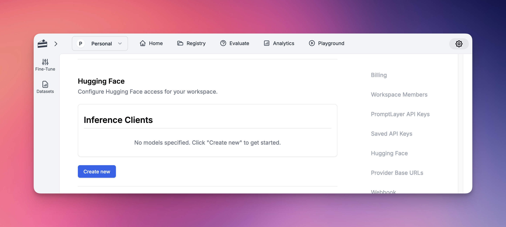
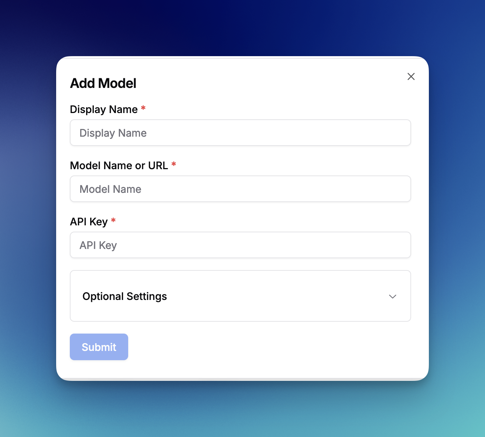

PromptLayer works seamlessly with many popular LLM frameworks and abstractions.

Don't see your framework listed? You can send traces from **any** OpenTelemetry-compatible tool using the [OpenTelemetry](/features/opentelemetry) page, or [email us!](mailto:hello@promptlayer.com)

## LiteLLM

[LiteLLM](https://github.com/BerriAI/litellm) allows you to call any LLM API all using the OpenAI format. This is the easiest way to swap in and out new models and see which one works best for your prompts. Works with models such as Anthropic, HuggingFace, Cohere, PaLM, Replicate, Azure.

Please read the [LiteLLM documentation page](https://docs.litellm.ai/docs/observability/promptlayer_integration)

## LlamaIndex 

[LlamaIndex](https://www.llamaindex.ai/) is a data framework for LLM-based applications. Read more about our integration on the [LlamaIndex documentation page](https://docs.llamaindex.ai/en/stable/module_guides/observability/observability.html#promptlayer)

## Claude Code

PromptLayer supports [Claude Code](https://docs.anthropic.com/en/docs/claude-code/overview) in two setup modes:

- **CLI:** install the PromptLayer Claude plugin directly into Claude Code.
- **SDK:** use the PromptLayer JavaScript or Python helper to inject the same tracing plugin and environment variables into `ClaudeAgentOptions`.

The underlying tracing is the same in both cases. If you're using the SDK, you do not need to manually install the plugin or discover the plugin path yourself.

### CLI: Direct Plugin Install

Use this path if you're running Claude Code from the terminal and want PromptLayer enabled globally.

1. Install the plugin

```bash
claude plugin marketplace add MagnivOrg/promptlayer-claude-plugins
claude plugin install trace@promptlayer-claude-plugins
```

2. Run the setup script

```bash
$HOME/.claude/plugins/marketplaces/promptlayer-claude-plugins/plugins/trace/setup.sh
```

3. Enter your PromptLayer API key and keep the default endpoint: `https://api.promptlayer.com/v1/traces`
4. Start Claude Code and run a prompt

### SDK: JavaScript Or Python

Use this path if you're embedding Claude Code through Anthropic's SDK and want PromptLayer configured in code.

<Note>
The PromptLayer Claude SDK helpers currently support macOS and Linux. Windows is not supported.
</Note>

1. Install the required packages

<CodeGroup>
```bash JavaScript
npm install promptlayer @anthropic-ai/claude-agent-sdk
```

```bash Python
pip install "promptlayer[claude-agents]"
```
</CodeGroup>

2. Generate PromptLayer Claude config and pass it into `ClaudeAgentOptions`

<CodeGroup>
```ts JavaScript
import { ClaudeAgentOptions } from "@anthropic-ai/claude-agent-sdk";
import { getClaudeConfig } from "promptlayer/claude-agents";

const plClaudeConfig = getClaudeConfig();

const options = new ClaudeAgentOptions({
  model: "sonnet",
  cwd: process.cwd(),
  plugins: [plClaudeConfig.plugin],
  env: {
    ...plClaudeConfig.env,
  },
});
```

```python Python
from claude_agent_sdk import ClaudeAgentOptions
from promptlayer.integrations.claude_agents import get_claude_config

pl_claude_config = get_claude_config()

options = ClaudeAgentOptions(
    model="sonnet",
    cwd=".",
    plugins=[pl_claude_config.plugin],
    env={**pl_claude_config.env},
)
```
</CodeGroup>

`getClaudeConfig()` and `get_claude_config()` read `PROMPTLAYER_API_KEY` by default and return:

- a local plugin reference for Claude SDK `plugins`
- PromptLayer environment variables for Claude SDK `env`

3. Start your Claude SDK client or agent with those options

Once configured, PromptLayer will capture Claude Code sessions, LLM calls, tool calls, prompts, completions, token usage, and model metadata.

For troubleshooting and additional details on the direct plugin install path, see the [PromptLayer Claude Code plugin repository](https://github.com/MagnivOrg/promptlayer-claude-plugins).

## Vercel AI SDK

PromptLayer supports integration with the [Vercel AI SDK](https://ai-sdk.dev/docs), allowing you to export OpenTelemetry traces from your application directly to PromptLayer.

To set up:

1. Install OpenTelemetry packages

```bash
npm install @opentelemetry/sdk-node \
  @opentelemetry/exporter-trace-otlp-http \
  @opentelemetry/resources
```

2. Configure OpenTelemetry with PromptLayer as the exporter

```ts
const sdk = new NodeSDK({
  serviceName: "your-app-name",
  resource: resourceFromAttributes({
    "promptlayer.telemetry.source": "vercel-ai-sdk",
  }),
  traceExporter: new OTLPTraceExporter({
    url: "https://api.promptlayer.com/v1/traces",
    headers: {
      "X-API-Key": process.env.PROMPTLAYER_API_KEY,
    },
  }),
});
```

3. Start the SDK before AI calls and shut it down before exit
4. Add `experimental_telemetry` to your AI SDK calls

```ts
experimental_telemetry: {
  isEnabled: true,
  recordInputs: true,
  recordOutputs: true,
}
```

For best results, set `promptlayer.telemetry.source` to `vercel-ai-sdk` so PromptLayer can parse the traces correctly.

Once configured, PromptLayer will capture LLM calls, inputs and outputs, token usage, tool traces, workflow spans, and model metadata.

## OpenAI Agents SDK

PromptLayer supports the OpenAI Agents SDK in both [JavaScript](https://openai.github.io/openai-agents-js/) and [Python](https://openai.github.io/openai-agents-python/), allowing you to export agent traces directly to PromptLayer with a native PromptLayer trace processor.

To set up:

1. Install the required packages

<CodeGroup>
```bash JavaScript
npm install promptlayer @openai/agents
```

```bash Python
pip install "promptlayer[openai-agents]"
```
</CodeGroup>

2. Register PromptLayer tracing before your first agent run:

<CodeGroup>
```ts JavaScript
import { instrumentOpenAIAgents } from "promptlayer/openai-agents";

const processor = await instrumentOpenAIAgents();
```

```python Python
from promptlayer.integrations.openai_agents import instrument_openai_agents

instrument_openai_agents()
```
</CodeGroup>

3. Flush tracing before process exit so PromptLayer receives the final spans:

<CodeGroup>
```ts JavaScript
await processor.forceFlush();
await processor.shutdown();
```

```python Python
# Optional - if you created your own tracer provider
tracer_provider.force_flush()
tracer_provider.shutdown()
```
</CodeGroup>

4. Set your environment variables:

- `OPENAI_API_KEY`
- `PROMPTLAYER_API_KEY`

## OpenRouter

PromptLayer supports ingesting traces from [OpenRouter](https://openrouter.ai) through OpenRouter's Broadcast integration for the [OpenTelemetry Collector](https://openrouter.ai/docs/guides/features/broadcast/otel-collector).

To set up:

1. Get your PromptLayer API key from your PromptLayer workspace
2. In OpenRouter, go to **Settings -> Observability**
3. Toggle **Enable Broadcast**
4. Click the edit icon next to **OpenTelemetry Collector**
5. Leave the default name or rename the destination if you want
6. Configure the destination with PromptLayer's OTLP endpoint:

```text
Endpoint: https://api.promptlayer.com/v1/traces
```

7. Add your PromptLayer API key in the headers JSON:

```json
{
  "X-API-Key": "pl_..."
}
```

8. Click **Test Connection**
9. Click **Send Trace** if you want to verify the integration end-to-end from OpenRouter's UI
10. Save the destination once the test passes
11. Send requests through OpenRouter as usual

Once configured, PromptLayer will ingest the OpenRouter OTLP spans and convert GenAI spans into trace views and request logs.

<Tip>
This integration is for ingesting traces from OpenRouter into PromptLayer. If you also want to use OpenRouter models inside PromptLayer as a provider, see [OpenRouter](/features/openrouter-integration).
</Tip>

## Hugging Face

PromptLayer supports integration with [Hugging Face](https://huggingface.co/models), allowing you to use any model available on Hugging Face within the platform. To set up:

1. Go to Settings
2. Navigate to the Hugging Face section
3. Click "Create New"



