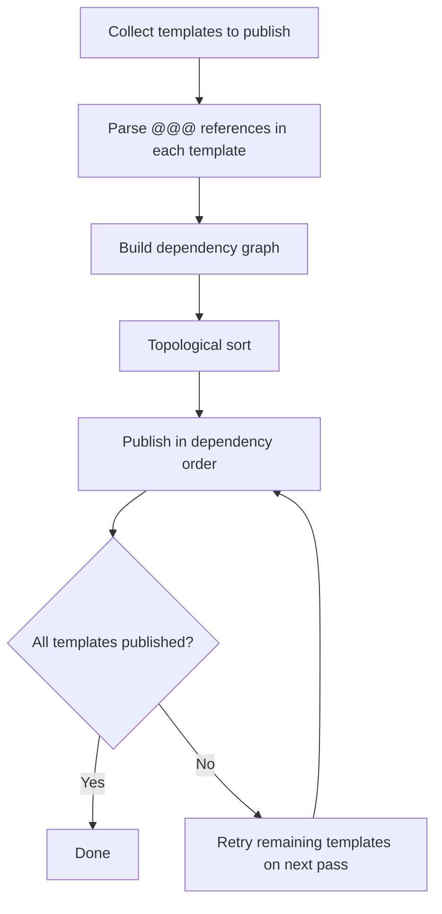

When you publish prompt templates programmatically, any template that references snippets with `@@@snippet_name@@@` must be published **after** its dependencies. Publishing a parent template before its referenced snippets exist in the workspace fails validation.

This guide explains the snippet dependency model, the required publish order, and a multi-pass workflow for CI pipelines and MCP agents.

## Snippet dependency model

A snippet is a completion prompt template referenced from another template using `@@@` syntax. Snippets can reference other snippets, forming a dependency graph.

See [Snippets](/features/prompt-registry/snippets) for the three reference formats:

1. **By template name**: `@@@template_name@@@` — uses the latest version of the referenced template.
2. **By version number**: `@@@template_name@version_number:{number}@@@` — pins a specific version.
3. **By release label**: `@@@template_name@label:{label_name}@@@` — uses the version with that label.

When a parent template is published, PromptLayer validates that every referenced snippet already exists in the workspace. At read time, PromptLayer resolves snippet references recursively and replaces `@@@` tags with snippet content.

<Note>
Only completion templates can be used as snippets. See [Snippets](/features/prompt-registry/snippets#restrictions) for details.
</Note>

## Required publish ordering

Publish templates in **dependency-first** order: leaf snippets with no snippet references first, then templates that depend on them, and finally parent prompts that compose multiple snippets.

### Example dependency graph

| Template | Content includes | Depends on |
| --- | --- | --- |
| `base-instructions` | Standalone completion text | — |
| `tone-guide` | `@@@base-instructions@@@` plus tone rules | `base-instructions` |
| `customer-support` | `@@@tone-guide@@@` and `@@@base-instructions@@@` | `tone-guide`, `base-instructions` |

**Correct publish order:**

1. `base-instructions`
2. `tone-guide`
3. `customer-support`

**Incorrect:** Publishing `customer-support` or `tone-guide` before `base-instructions` fails because the referenced snippet does not exist yet.

## Multi-pass publish workflow

CI pipelines and MCP agents that bulk-publish templates should resolve dependencies before publishing. Use a multi-pass approach when templates reference each other.



### Step 1: Discover snippet references

Fetch each template with snippet resolution disabled so `@@@` references stay in the raw content:

<CodeGroup>

```python Python
import re
import requests

SNIPPET_REF_PATTERN = re.compile(r"@@@([^@]+?)@@@")

def extract_snippet_refs(prompt_template: str) -> set[str]:
    refs = set()
    for match in SNIPPET_REF_PATTERN.finditer(prompt_template):
        ref = match.group(1)
        # Strip version/label suffixes to get the base template name
        base_name = ref.split("@version_number:")[0].split("@label:")[0]
        refs.add(base_name)
    return refs

response = requests.get(
    "https://api.promptlayer.com/prompt-templates/customer-support",
    headers={"X-API-KEY": "pl_your_key_here"},
    params={"resolve_snippets": False},
)
raw = response.json()
refs = extract_snippet_refs(str(raw["prompt_template"]))
```

```bash REST API
curl "https://api.promptlayer.com/prompt-templates/customer-support?resolve_snippets=false" \
  -H "X-API-KEY: $PROMPTLAYER_API_KEY"
```

</CodeGroup>

The [Get Prompt Template (Raw)](/reference/templates-get-raw) endpoint also returns a `snippets` array listing resolved snippet references when `resolve_snippets=true`.

### Step 2: Build and sort the dependency graph

For each template you plan to publish, collect its snippet dependencies and topologically sort so dependencies come first. Templates with no snippet references are leaves and publish first.

If template A references template B, and both are in your publish batch, B must appear before A in the sorted list.

### Step 3: Publish in order

Publish each template after its dependencies exist in the workspace.

<CodeGroup>

```python Python
for prompt_name in publish_order:
    pl_client.templates.publish(
        prompt_name=prompt_name,
        prompt_template=templates[prompt_name],
    )
```

```bash REST API
curl -X POST https://api.promptlayer.com/rest/prompt-templates \
  -H "X-API-KEY: $PROMPTLAYER_API_KEY" \
  -H "Content-Type: application/json" \
  -d @prompts/base-instructions.json
```

</CodeGroup>

See [Publish Prompt Template](/reference/templates-publish) for the full request schema.

### Step 4: Retry on failure (multi-pass)

If a publish fails because a dependency is not yet available, skip that template and retry it on the next pass after its dependencies are published. Stop when all templates succeed or a pass makes no progress (which indicates a circular reference or a missing external dependency).

<Warning>
Circular snippet references are not supported. If template A references B and B references A, publishing will fail. Break the cycle before publishing.
</Warning>

## MCP agent workflow

When using the [PromptLayer MCP server](/agents/overview), the same dependency-first ordering applies to `publish-prompt-template`.

Recommended tool sequence:

1. **`list-prompt-templates`** — list templates in the workspace. Use `is_snippet=true` to filter snippets.
2. **`get-prompt-template-raw`** — fetch raw content with unresolved `@@@` references to discover dependencies.
3. **`get-snippet-usage`** — find which prompts reference a snippet (useful for impact analysis before republishing).
4. **`publish-prompt-template`** — publish templates in dependency-first order.

Agents should parse `@@@` references from raw template content, sort templates topologically, and publish leaf snippets before parents. If a publish fails, retry remaining templates on subsequent passes.

## CI/CD and GitOps

When syncing prompts from a Git repository to PromptLayer, publish snippet dependencies before parent templates. See [Deployment Strategies](/onboarding-guides/deployment-strategies) for CI/CD patterns.

A typical GitOps pipeline should:

1. Parse all prompt files in the repository.
2. Extract `@@@` snippet references from each file.
3. Topologically sort templates by dependency.
4. Publish in sorted order, retrying failed templates on subsequent passes.

## Publish errors

When a parent template references a snippet that does not exist in the workspace, [Publish Prompt Template](/reference/templates-publish) returns a **422 Validation Error**.

To debug:

1. Confirm the referenced snippet name matches exactly (snippet names are case-sensitive).
2. Verify the dependency was published in an earlier pass.
3. Use [Get Snippet Usage](/reference/get-snippet-usage) to confirm whether a snippet exists and which prompts reference it.
4. Fetch the parent template with `resolve_snippets=false` to inspect unresolved `@@@` references.

## Related

- [Snippets](/features/prompt-registry/snippets) — snippet syntax, rendering, and restrictions
- [Publish Prompt Template](/reference/templates-publish) — REST API for programmatic publishing
- [Get Prompt Template (Raw)](/reference/templates-get-raw) — inspect unresolved snippet references
- [Get Snippet Usage](/reference/get-snippet-usage) — find prompts that reference a snippet
- [MCP & Skills](/agents/overview) — MCP tools for prompt publishing
- [Deployment Strategies](/onboarding-guides/deployment-strategies) — CI/CD and GitOps patterns
