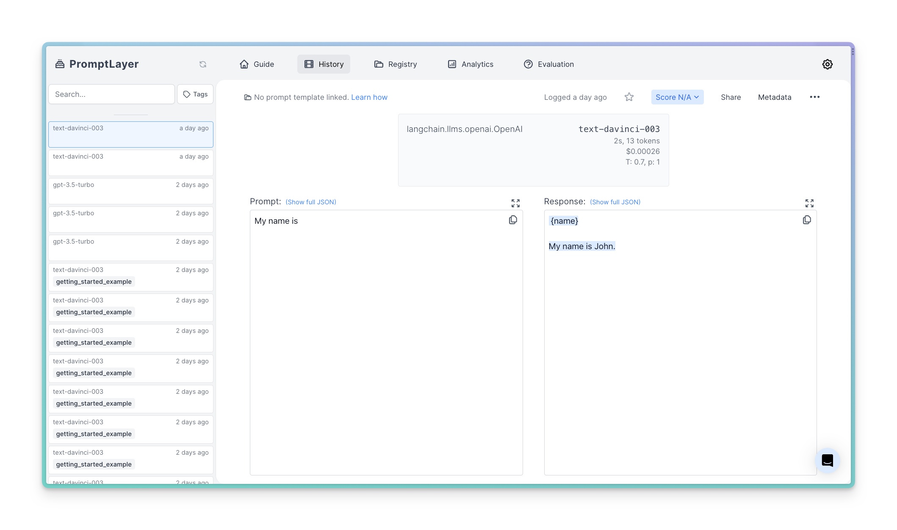
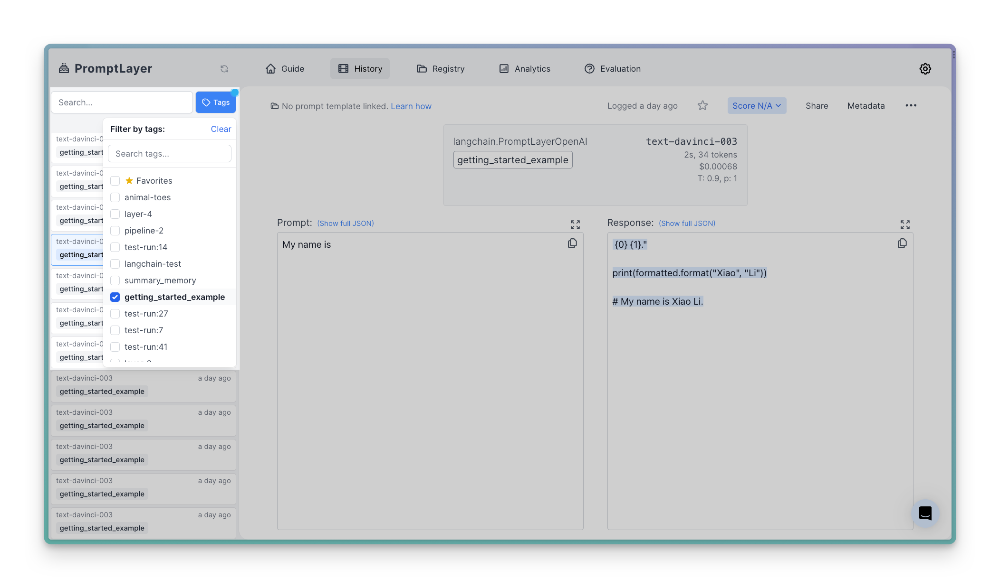
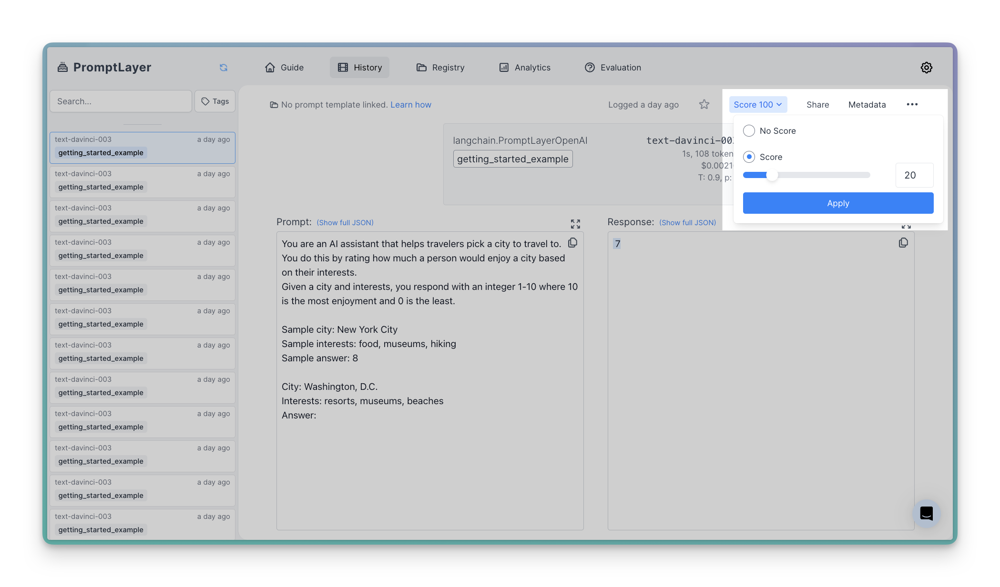

In this tutorial, we will guide you through the process of data-driven prompt engineering.

PromptLayer provides a unified interface for working with different language models, making and scoring requests, and tracking your prompts and requests. It supports a variety of models, from OpenAI, Anthropic, HuggingFace, and more.

Whether you're a data scientist, a machine learning engineer, or a developer, PromptLayer can help you manage your language models more effectively and efficiently. Let's get started!


### Setting Up Your Environment

Before we get started, we need to load our environment variables from a `.env` file. This file should contain your API keys for PromptLayer and OpenAI. 

Get your PromptLayer API key through our dashboard by signing up at www.promptlayer.com

```txt .env
OPENAI_API_KEY=<YOUR_OPENAI_API_KEY>
PROMPTLAYER_API_KEY=<YOUR_PROMPTLAYER_API_KEY>
```

We can load these variables using the `dotenv` package:

<CodeGroup>

```python Python
from dotenv import load_dotenv

# Load environment variables from .env file
load_dotenv('.env')
```

```js Javascript
// You would use the `dotenv` package in Node.js to load environment variables
// Install with `npm install dotenv`

require('dotenv').config({ path: '.env' });
```

</CodeGroup>

Once we have loaded our environment variables, we can import `promptlayer` and set up our API key for PromptLayer. Make sure to `pip install promptlayer` first if you are using [Python](/languages/python).

<CodeGroup>

```python Python
import promptlayer
import os
promptlayer.api_key = os.environ.get("PROMPTLAYER_API_KEY")
```

```js Javascript
const promptLayerApiKey = process.env.PROMPTLAYER_API_KEY;
```
</CodeGroup>

### Making Your First Request

PromptLayer is at its core a REST library. Using our [Python SDK](/languages/python) is equivalent to directly making [requests to our API](/languages/rest-api), just a little easier.

Because latency is so important, the best way to use PromptLayer is to first make your request to OpenAI and then log the request to PromptLayer. This is how our Python SDK works under the hood.

If you are used to working with the Python SDK, all you will need to do is swap out your `import openai` for `openai = promptlayer.openai`. The rest of your code stays the same!

In this step we'll make a simple request to the OpenAI GPT-3 engine to generate a response for the prompt "My name is".

<CodeGroup>

```python Python openai >= 1.0.0
# Instead of `import openai` we will use
OpenAI = promptlayer.openai.OpenAI
openai = OpenAI()

# Make a completion to OpenAI
response = openai.completions.create(
  model="gpt-3.5-turbo-instruct", 
  prompt="My name is",
)
print(response.choices[0].text)
```

```python Python openai < 1.0.0
# Instead of `import openai` we will use
openai = promptlayer.openai
openai.api_key = os.environ.get("OPENAI_API_KEY")

# Make a completion to OpenAI
response = openai.Completion.create(
  engine="gpt-3.5-turbo-instruct", 
  prompt="My name is",
)
print(response.choices[0].text)
```

```js JavaScript
// Instead of `import openai` we will use
const OpenAI = promptlayer.OpenAI;
const openai = new OpenAI();

// Make a completion to OpenAI
const response = await openai.completions.create({
  model: "gpt-3.5-turbo-instruct",
  prompt: "My name is",
});

console.log(response.choices[0].text);
```

```python Python (LangChain)
from langchain.callbacks import PromptLayerCallbackHandler

# OpenAI Completion Model
from langchain.llms import OpenAI

# Set up OpenAI model with PromptLayer callback
llm = OpenAI(
    model_name="gpt-3.5-turbo-instruct", 
    callbacks=[PromptLayerCallbackHandler()],
)

# Make a completion to OpenAI
response = llm("My name is")
print(response)
```

```js Javascript (LangChain)
// Install with `npm install langchain`

// Use OpenAI completion LLMs with PromptLayer
const { PromptLayerOpenAI } = require("langchain/llms/openai");
const llm = new PromptLayerOpenAI({
  temperature: 0.9,
  openAIApiKey: process.env.OPENAI_API_KEY,
  promptLayerApiKey: process.env.PROMPTLAYER_API_KEY,
});

// Make a completion to OpenAI
llm.call("My name is").then(response => console.log(response));
```

```bash REST
curl --request POST \
  --url https://api.promptlayer.com/rest/track-request \
  --data '{
    "function_name": "openai.Completion.create",
    "kwargs": {"engine": "gpt-3.5-turbo-instruct", "prompt": "My name is"},
    "request_response": {...},
    "request_start_time": 1673987077.463504,
    "request_end_time": 1673987077.463504,
    "api_key": "pl_<YOUR API KEY>"
  }'
```
</CodeGroup>

The response you'll see should be a continuation of the prompt, such as "John. Nice to meet you, John."

Refresh the dashboard and voilà! ✨


## Enriching Requests

Enriching requests often requires a [PromptLayer request ID](/features/prompt-history/request-id). All PromptLayer requests have unique IDs, and these can be optionally returned when logging the request.

### Tagging a Request

We can also add tags (`pl_tags`) to our requests to make it easier to search through and organize requests on the dashboard.

[Learn more about tags.](features/prompt-history/tagging-requests)

<CodeGroup>

```python Python
response = openai.Completion.create(
  engine="gpt-3.5-turbo-instruct", 
  prompt="My name is",
  pl_tags=["getting_started_example"] # 🍰 PromptLayer tags
)

print(response.choices[0].text)
```

```js JavaScript
const response = await openai.completions.create({
  model: "gpt-3.5-turbo-instruct",
  prompt: "My name is",
  pl_tags: ["getting_started_example"], // 🍰 PromptLayer tags
});

console.log(response.choices[0].text)
```

```python Python (LangChain)
llm = OpenAI(
    model_name="gpt-3.5-turbo-instruct", 
    callbacks=[
        PromptLayerCallbackHandler(
            pl_tags=["getting_started_example"] # 🍰 PromptLayer tags
        ),
    ],
)

response = llm("My name is")
print(response)
```

```js Javascript (LangChain)
const llm = new PromptLayerOpenAI({
  temperature: 0.9,
  openAIApiKey: process.env.OPENAI_API_KEY,
  promptLayerApiKey: process.env.PROMPTLAYER_API_KEY,
  plTags: ["getting_started_example"], // 🍰 PromptLayer tags
});

llm.call("My name is").then(response => console.log(response));
```

```bash REST
curl --request POST \
  --url https://api.promptlayer.com/rest/track-request \
  --data '{
    "function_name": "openai.Completion.create",
    "kwargs": {"engine": "gpt-3.5-turbo-instruct", "prompt": "My name is"},
    "request_response": {...},
    "request_start_time": 1673987077.463504,
    "request_end_time": 1673987077.463504,
    "tags": [
        "getting_started_example"
    ],
    "api_key": "pl_<YOUR API KEY>"
  }'
```

</CodeGroup>

Filter by tags on the dashboard as seen below.


### Scoring a Request

Using PromptLayer we can score a request with an integer 0 - 100. This is most often used to understand how effective certain prompts are in production.

Users use scores in many ways [(learn more)](features/prompt-history/scoring-requests). Below are some examples:
- 100 if the generated code compiles, 0 if not
- 100 if the user denotes a thumbs-up, 0 for thumbs-down
- LLM synthetic evaluation of how much the output matched the prompt

Here, we ask for the capital of New York, and then score the response based on whether it contains the correct answer. 

To set the score, we make a second request to the PromptLayer API with the `request_id` and a score.

<CodeGroup>

```python Python
response, pl_request_id = openai.Completion.create(
  engine="gpt-3.5-turbo-instruct", 
  prompt="What is the capital of New York? \\n\\nThe capital of New York is",
  pl_tags=["getting_started_example"],
  return_pl_id=True # Make sure to set this to True
)

answer = response.choices[0].text
print(answer)
correct_answer = "albany" in answer.lower()

# Log score to 🍰 PromptLayer
promptlayer.track.score(
    request_id=pl_request_id,
    score=100 if correct_answer else 0,
)
```

```js JavaScript
const [response, pl_request_id] = await openai.completions.create({
  model: "gpt-3.5-turbo-instruct",
  prompt: "What is the capital of New York? \\n\\nThe capital of New York is",
  pl_tags: ["getting_started_example"],
  return_pl_id: true, // Make sure to set this to True
});

const answer = response.choices[0].text;
console.log(answer);
const correct_answer = "albany" in answer.lower();

// Log score to 🍰 PromptLayer
promptlayer.track.score({
  request_id: pl_request_id,
  score: correct_answer ? 100 : 0,
});
```

```python Python (LangChain)
"""
To retrieve the pl_request_id using LangChain, we
specify a callback function (pl_id_callback) 
that receives the ID on successful logging of the request.
"""

# Callback function that saves our request_id
pl_request_id = None
def save_pl_id(pl_id):
    global pl_request_id
    print("PromptLayer Request ID:", pl_id)
    pl_request_id = pl_id

llm = OpenAI(
    model_name="gpt-3.5-turbo-instruct",
    callbacks=[PromptLayerCallbackHandler(
            pl_id_callback=save_pl_id, # Here is where we set our callback func
            pl_tags=["getting_started_example"])],
)

# Let's see what the answer is...
answer = llm("What is the capital of New York? \\n\\nThe capital of New York is")
print(answer)

# Check if the answer is correct & log score to 🍰 PromptLayer
correct_answer = "albany" in answer.lower()
promptlayer.track.score(
    request_id=pl_request_id,
    score=100 if correct_answer else 0,
)
```

```js Javascript (LangChain)
const axios = require('axios');
const { PromptLayerOpenAI } = require("langchain/llms/openai");

const llm = new PromptLayerOpenAI({
  temperature: 0.9,
  openAIApiKey: process.env.OPENAI_API_KEY,
  promptLayerApiKey: process.env.PROMPTLAYER_API_KEY,
  plTags: ["getting_started_example"],
  returnPromptLayerId: true,
});

// You need to use .generate to retrieve the request_id
llm.generate(["What is the capital of New York? \\n\\nThe capital of New York is"]).then(response => {
    const promptLayerRequestId = response.generations[0][0].generationInfo.promptLayerRequestId;
    const answer = response.generations[0][0].text;
    console.log(answer);

    // Figure out if the answer is correct...
    const correctAnswer = answer.toLowerCase().includes("albany");

    // Score answer with 🍰 PromptLayer
    axios
        .post('https://api.promptlayer.com/rest/track-score', {
            request_id: promptLayerRequestId,
            score: correctAnswer ? 100 : 0,
            api_key: process.env.PROMPTLAYER_API_KEY,
        })
        .then(_ => {
            console.log("Successfully scored answer");
        })
        .catch(error => {
            console.error(error);
        });
});
```

```bash REST
# Create a request
curl --request POST \
  --url https://api.promptlayer.com/rest/track-request \
  --data '{
    "function_name": "openai.Completion.create",
    "kwargs": {"engine": "gpt-3.5-turbo-instruct", "prompt": "What is the capital of New York? \\n\\nThe capital of New York is"},
    "request_response": {...},
    "request_start_time": 1673987077.463504,
    "request_end_time": 1673987077.463504,
    "tags": [
        "getting_started_example"
    ],
    "api_key": "pl_<YOUR API KEY>"
  }'

# Score the request
curl --request POST \
  --url https://api.promptlayer.com/rest/track-score \
  --data '{
    "request_id": "<YOUR REQUEST ID>",
    "score": <YOUR SCORE>,
    "api_key": "pl_<YOUR API KEY>"
  }'
```

</CodeGroup>

Scores can also be set visually in the dashboard.


### Adding Metadata

We can add metadata to a request to store additional information about it. Metadata is a map of string keys to string values. 

Metadata is used to associate requests with specific users, track rollouts, and to store things like error messages (maybe from generated code). You can then filter requests & analytics on the PromptLayer dashboard using metadata keys.

[Learn more about metadata.](features/prompt-history/metadata)

Here, we make a request to rate how much a person would enjoy a city based on their interests, and then add metadata such as the user's ID and location:

<CodeGroup>

```python Python
prompt_template = """You are an AI assistant that helps travelers pick a city to travel to. 
You do this by rating how much a person would enjoy a city based on their interests.
Given a city and interests, you respond with an integer 1-10 where 10 is the most enjoyment and 0 is the least.

Sample city: New York City
Sample interests: food, museums, hiking
Sample answer: 8

City: {city}
Interests: {interests}
Answer: """

response, pl_request_id = openai.Completion.create(
  engine="gpt-3.5-turbo-instruct", 
  prompt=prompt_template.format(city="Washington, D.C.", interests="resorts, museums, beaches"),
  pl_tags=["getting_started_example"],
  return_pl_id=True
)

answer = response.choices[0].text
print(answer)

# Let's convert the answer to an int
numeric_answer = None
error_message = None
try:
    numeric_answer = int(answer.strip())
except ValueError as e:
    error_message = str(e)
    pass

# Use score in 🍰 PromptLayer to track if answer was an int
promptlayer.track.score(
    request_id=pl_request_id,
    score=100 if numeric_answer else 0,
)

print("Numeric answer:", numeric_answer)

# Log metadata for request in 🍰 PromptLayer
promptlayer.track.metadata(
    request_id=pl_request_id,
    metadata={
        "referrer": "getting_started.ipynb",
        "origin": "NYC, USA",
        "user_id": "sdf328",
        "error_message": "No error" if numeric_answer else error_message,
    }
)
```

```js JavaScript
const prompt_template = `
  You are an AI assistant that helps travelers pick a city to travel to.
  You do this by rating how much a person would enjoy a city based on their interests.
  Given a city and interests, you respond with an integer 1-10 where 10 is the most enjoyment and 0 is the least.
  
  Sample city: New York City
  Sample interests: food, museums, hiking
  Sample answer: 8
  
  City: {city}
  Interests: {interests}
  Answer: `;

const inputVariables = {
  city: "Washington, D.C.",
  interests: "resorts, museums, beaches",
};
let replacedPromptTemplate = prompt_template;
Object.entries(inputVariables).forEach(([key, value]) => {
  replacedPromptTemplate = replacedPromptTemplate.replace(`{${key}}`, value);
});

const [response, pl_request_id] = await openai.completions.create({
  model: "gpt-3.5-turbo-instruct",
  prompt: replacedPromptTemplate,
  pl_tags: ["getting_started_example"],
  return_pl_id: true,
});

const answer = response.choices[0].text;
console.log(answer);

// Let's convert the answer to an int
let numeric_answer = null;
let error_message = null;

try {
  numeric_answer = parseInt(answer.strip());
} catch (e) {
  error_message = String(e);
}

// Use score in 🍰 PromptLayer to track if answer was an int
promptlayer.track.score({
  request_id: pl_request_id,
  score: numeric_answer ? 100 : 0,
});

console.log("Numeric answer:", numeric_answer);

// Log metadata for request in 🍰 PromptLayer
promptlayer.track.metadata({
  request_id: pl_request_id,
  metadata: {
    referrer: "getting_started.ipynb",
    origin: "NYC, USA",
    user_id: "sdf328",
    error_message: "No error", // if numeric_answer else error_message,
  },
});

```

```python Python (LangChain)
pl_request_id = None
def save_pl_id(pl_id):
    global pl_request_id
    pl_request_id = pl_id

prompt_template = """You are an AI assistant that helps travelers pick a city to travel to. 
You do this by rating how much a person would enjoy a city based on their interests.
Given a city and interests, you respond with an integer 1-10 where 10 is the most enjoyment and 0 is the least.

Sample city: New York City
Sample interests: food, museums, hiking
Sample answer: 8

City: {city}
Interests: {interests}
Answer: """

llm = OpenAI(
    model_name="gpt-3.5-turbo-instruct", 
    callbacks=[PromptLayerCallbackHandler(
            pl_id_callback=save_pl_id, 
            pl_tags=["getting_started_example"])],
)

# Let's get the answer...
answer = llm(prompt_template.format(city="Washington, D.C.", interests="resorts, museums, beaches"))
print(answer)

# Let's conver the answer to an int
numeric_answer = None
error_message = None
try:
    numeric_answer = int(answer.strip())
except ValueError as e:
    error_message = str(e)
    pass

# Use score in 🍰 PromptLayer to track if answer was an int
promptlayer.track.score(
    request_id=pl_request_id,
    score=100 if numeric_answer else 0,
)

print("Numeric answer:", numeric_answer)

# Log metadata for request in 🍰 PromptLayer
promptlayer.track.metadata(
    request_id=pl_request_id,
    metadata={
        "referrer": "getting_started.ipynb",
        "origin": "NYC, USA",
        "user_id": "sdf328",
        "error_message": "No error" if numeric_answer else error_message,
    }
)
```

```js Javascript (LangChain)
const promptTemplate = `You are an AI assistant that helps travelers pick a city to travel to. 
You do this by rating how much a person would enjoy a city based on their interests.
Given a city and interests, you respond with an integer 1-10 where 10 is the most enjoyment and 0 is the least.

Sample city: New York City
Sample interests: food, museums, hiking
Sample answer: 8

City: {city}
Interests: {interests}
Answer: `;

const llm = new PromptLayerOpenAI({
  temperature: 0.9,
  openAIApiKey: process.env.OPENAI_API_KEY,
  promptLayerApiKey: process.env.PROMPTLAYER_API_KEY,
  plTags: ["getting_started_example"],
  returnPromptLayerId: true,
});

// Replace input variables in our prompt template
const inputVariables = {city: "Washington, D.C.", interests: "resorts, museums, beaches"};
let replacedPromptTemplate = promptTemplate;
Object.entries(inputVariables).forEach(([key, value]) => {
  replacedPromptTemplate = replacedPromptTemplate.replace(`{${key}}`, value);
});

llm.generate([replacedPromptTemplate]).then(response => {
    const promptLayerRequestId = response.generations[0][0].generationInfo.promptLayerRequestId;
    const answer = response.generations[0][0].text;
    console.log(answer);

    // Let's conver the answer to an int
    let numericAnswer = null;
    let errorMessage = null;
    try {
        numericAnswer = parseInt(answer.trim());
    } catch (e) {
        errorMessage = e.toString();
    }
    
    // Use score in 🍰 PromptLayer to track if answer was an int
    axios
        .post('https://api.promptlayer.com/rest/track-score', {
            request_id: promptLayerRequestId,
            score: numericAnswer ? 100 : 0,
            api_key: process.env.PROMPTLAYER_API_KEY,
        })
        .then(_ => {
            console.log("Successfully scored answer");
        })
        .catch(error => {
            console.error(error);
        });

    const metadata = {
        referrer: "getting_started.ipynb",
        origin: "NYC, USA",
        userId: "sdf328",
        errorMessage: numericAnswer ? "No error" : errorMessage,
    };
    // Log metadata for request in 🍰 PromptLayer
    axios
        .post('https://api.promptlayer.com/rest/track-metadata', {
            request_id: promptLayerRequestId,
            metadata: metadata,
            api_key: process.env.PROMPTLAYER_API_KEY,
        })
        .then(_ => {
            console.log("Successfully logged metadata");
        })
        .catch(error => {
            console.error(error);
        });
});
```

```bash REST
# Create a request
curl --request POST \
  --url https://api.promptlayer.com/rest/track-request \
  --data '{
    "function_name": "openai.Completion.create",
    "kwargs": {"engine": "gpt-3.5-turbo-instruct", "prompt": "<YOUR_PROMPT>"},
    "request_response": {...},
    "request_start_time": 1673987077.463504,
    "request_end_time": 1673987077.463504,
    "tags": [
        "getting_started_example"
    ],
    "api_key": "pl_<YOUR API KEY>"
  }'

# Score the request
curl --request POST \
  --url https://api.promptlayer.com/rest/track-score \
  --data '{
    "request_id": "<YOUR REQUEST ID>",
    "score": <YOUR SCORE>,
    "api_key": "pl_<YOUR API KEY>"
  }'

# Add metadata to the request
curl --request POST \
  --url https://api.promptlayer.com/rest/track-metadata \
  --data '{
    "request_id": "<YOUR REQUEST ID>",
    "api_key": "pl_<YOUR API KEY>",
    "metadata": {
        "referrer": "getting_started.ipynb",
        "origin": "NYC, USA",
        "user_id": "sdf328",
        "error_message": "<YOUR ERROR MESSAGE>"
    }
  }'
```
</CodeGroup>

## Analytics & Search

Now that you have successfully tagged requests with tags & metadata, you can use these features to better sort through requests in the dashboard.

The [Analytics page](/why-promptlayer/analytics) shows high-level graphs and statistics about your usage. You can use metadata keys or tags to filter analytics.

<video controls="controls">
    <source src="/videos/getting-started-analytics.mp4" type="video/mp4" />
</video> 

You can also take advantage of our [advanced search](/why-promptlayer/advanced-search) by using metadata to search in the sidebar.

<video controls="controls">
    <source src="/videos/getting-started-advanced-search.mp4" type="video/mp4" />
</video> 

## Prompt Templates

### Creating a Prompt in the Registry

We can create a prompt in the PromptLayer [Prompt Registry](/features/prompt-registry). This allows us to easily reuse this prompt in the future:

<video controls="controls">
    <source src="/videos/getting-started-prompt-registry.mp4" type="video/mp4" />
</video> 

After creating a prompt template, we can retrieve it programmatically using the API. The Prompt Registry is often used as a prompt template CMS to avoid blocking prompt changes on eng rollouts.

The Prompt Registry handles versioning, just visually edit the prompt in the dashboard to save a new version. As you can see below, we can retrieve the latest prompt or a specific stable version.

<CodeGroup>

```python Python
city_choice_prompt = promptlayer.templates.get("city_choice")
city_choice_prompt_v1 = promptlayer.templates.get("city_choice", { "version": 1 })
city_choice_prompt_prod = promptlayer.templates.get("city_choice", { "label": "prod" })
print(city_choice_prompt_v1['prompt_template'])
```

```js JavaScript
const city_choice_prompt = await promptlayer.templates.get("city_choice");
const city_choice_prompt_v1 = await promptlayer.templates.get("city_choice",{ version: 1 });
const city_choice_prompt_prod = await promptlayer.templates.get("city_choice", { label: "prod" });
console.log(city_choice_prompt_v1["prompt_template"]);
```

```js Javascript (REST)
axios
    .post(
      "https://api.promptlayer.com/prompt-templates/city_choice",
      {
        headers: {
          "X-API-KEY": process.env.PROMPTLAYER_API_KEY,
        },
      }
    )
    .then(function (response) {
      console.log(response.data);
    })
    .catch(function (error) {
      console.log(error);
    });

  axios
    .post(
      "https://api.promptlayer.com/prompt-templates/city_choice",
      {
        version: 1,
      },
      {
        headers: {
          "X-API-KEY": process.env.PROMPTLAYER_API_KEY,
        },
      }
    )
    .then(function (response) {
      console.log(response.data);
    })
    .catch(function (error) {
      console.log(error);
    });
```

```bash REST
# Get a prompt by its name
curl --request POST \
  --url 'https://api.promptlayer.com/prompt-templates/<PROMPT_NAME>' \
  --header 'X-API-KEY: <YOUR PROMPTLAYER API KEY>'

# Get a prompt by its name and version
curl --request POST \
  --url 'https://api.promptlayer.com/prompt-templates/<PROMPT_NAME>' \
  --header 'X-API-KEY: <YOUR PROMPTLAYER API KEY>'
  --data '{
    "version": <VERSION_NUM>
  }'
```
</CodeGroup>

### Linking a Prompt to a Request

The Prompt Registry becomes the most useful when you start linking requests with prompt template versions. This makes it easy to compare prompt templates across latency, cost, and quality. It also let's you easily understand the input variables and how they change.

Once a prompt is in the registry, we can link it to a request ([learn more](features/prompt-history/tracking-templates)):

<CodeGroup>

```python Python
# Grab the prompt template
input_variables = {
    "city": "Washington, D.C.", 
    "interests": "resorts, museums, beaches"
}

city_choice_prompt = promptlayer.templates.get("city_choice",
{
  "provider": "openai",
  "input_variables": input_variables
})

response, pl_request_id = client.completions.create(
  **city_choice_prompt['llm_kwargs'],
  model="gpt-3.5-turbo-instruct", 
  pl_tags=["getting_started_example"],
  return_pl_id=True
)
print("Answer:", response.choices[0].text)

# Associate the request with the prompt template we used
promptlayer.track.prompt(request_id=pl_request_id, 
    prompt_name='city_choice', prompt_input_variables=input_variables)
```

```js JavaScript
// Grab the prompt template
  
const input_variables = {
  city: "Washington, D.C.",
  interests: "resorts, museums, beaches",
};
const city_choice_prompt = await promptlayer.templates.get("city_choice", {
  provider: "openai",
  input_variables,
});

const [response, pl_request_id] = await openai.completions.create({
  ...city_choice_prompt.llm_kwargs,
  model: "gpt-3.5-turbo-instruct",
  pl_tags: ["getting_started_example"],
  return_pl_id: true,
});
console.log("Answer:", response.choices[0].text);

// Associate the request with the prompt template we used
promptlayer.track.prompt({
  request_id: pl_request_id,
  prompt_name: "city_choice",
  prompt_input_variables: input_variables,
});
```

```bash REST
# Associate a previous request with a prompt template
curl --request POST \
  --url https://api.promptlayer.com/rest/track-prompt \
  --data '{
    "prompt_name": "city_choice",
    "prompt_input_variables": `{"city": "Washington, D.C.", "interests": "resorts, museums, beaches"}`,
    "api_key": "pl_<YOUR API KEY>",
    "request_id": "<YOUR REQUEST ID>"
  }'
```
</CodeGroup>

### Prompt template evaluation

Now that you have created multiple versions of a prompt template and associated it with request logs, navigate back to the Prompt Registry to find statistics about each version.

PromptLayer lets you compare prompt templates across score, latency, and cost. You can also easily see which requests used which templates.


## Using Different Models

In addition to those provided by OpenAI, PromptLayer supports many other providers and model types. 

### Chat-GPT

Here's an example of how to use a chat model from OpenAI:

<CodeGroup>

```python Python
openai = promptlayer.openai

response = openai.ChatCompletion.create(
    model="gpt-3.5-turbo",
    messages=[
        {"role": "system", "content": "You are a helpful AI assistant that helps people bake."},
        {"role": "user", "content": "How do you make a layer cake?"}
    ],
)
print(response.choices[0].message.content)
```

```js JavaScript
const response = await openai.chat.completions.create({
  model: "gpt-3.5-turbo",
  messages: [
    {
      role: "system",
      content: "You are a helpful AI assistant that helps people bake.",
    },
    { role: "user", content: "How do you make a layer cake?" },
  ],
});
console.log(response.choices[0].message.content);
```

```python Python (LangChain)
from langchain.chat_models import ChatOpenAI
from langchain.schema import AIMessage, HumanMessage, SystemMessage

llm = ChatOpenAI(model="gpt-3.5-turbo", callbacks=[PromptLayerCallbackHandler()])

response = llm(
    [
        SystemMessage(content="You are a helpful AI assistant that helps people bake."),
        HumanMessage(content="How do you make a layer cake?"),
    ]
)
print(response)
```

```js Javascript (LangChain)
const { PromptLayerChatOpenAI } = require("langchain/chat_models/openai");
const { SystemMessage, HumanMessage } = require("langchain/schema");
const chat = new PromptLayerChatOpenAI({
    returnPromptLayerId: true,
    openAIApiKey: process.env.OPENAI_API_KEY,
    promptLayerApiKey: process.env.PROMPTLAYER_API_KEY,
    });
chat.call([
  new SystemMessage("You are a helpful AI assistant."),
  new HumanMessage("What's your name?")
]).then(response => console.log(response));
```

```bash REST
curl --request POST \
  --url https://api.promptlayer.com/rest/track-request \
  --data '{
    "function_name": "openai.Completion.create",
    "kwargs": {
        "engine": "gpt-3.5-turbo",
        "messages": [
            {"role": "system", "content": "You are a helpful AI assistant that helps people bake."},
            {"role": "user", "content": "How do you make a layer cake?"}
        ]
    },
    "request_response": {...},
    "request_start_time": 1673987077.463504,
    "request_end_time": 1673987077.463504,
    "api_key": "pl_<YOUR API KEY>"
  }'
```
</CodeGroup>

### Anthropic

We can also use models from Anthropic natively with the PromptLayer Python SDK:

<CodeGroup>

```python Python
# Swap out 'from anthropic import Anthropic'
Anthropic = promptlayer.anthropic.Anthropic

anthropic = Anthropic()
completion = anthropic.completions.create(
    model="claude-2",
    max_tokens_to_sample=300,
    prompt=f"{anthropic.HUMAN_PROMPT} Compose a poem please.{anthropic.AI_PROMPT}",
    pl_tags=["getting-started"]
)
print(completion.completion)
```

```js JavaScript
const Anthropic = promptlayer.Anthropic;
const anthropic = new Anthropic();

const response = await anthropic.completions.create({
  prompt: `${Anthropic.HUMAN_PROMPT} How many toes do dogs have? ${Anthropic.AI_PROMPT}`,
  stop_sequences: [Anthropic.HUMAN_PROMPT],
  model: "claude-2",
  max_tokens_to_sample: 100,
  pl_tags: ["claude"],
});
console.log(response.completion);
```

</CodeGroup>

### HuggingFaceHub

Here's an example of using the Falcon-7b model from HuggingFaceHub. By using LangChain with the `PromptLayerCallbackHandler`, you can access tons of LLMs. [Learn more.](languages/langchain#huggingface-hub)

```python
from langchain.callbacks import PromptLayerCallbackHandler
from langchain import HuggingFaceHub

falcon = "tiiuae/falcon-7b-instruct"

llm = HuggingFaceHub(
    repo_id=falcon, 
    huggingfacehub_api_token=os.environ.get("HUGGING_FACE_API_KEY"), 
    model_kwargs={"temperature": 1.0, "max_length": 64}, 
    callbacks=[PromptLayerCallbackHandler(pl_tags=["falcon-7b"])]
)
request = llm("How do you make a layer cake?")
print(request)
```

And that's it! With this tutorial, you should now be able to use PromptLayer to work with different language models, make and score requests, and track your prompts and requests. Enjoy using PromptLayer!
