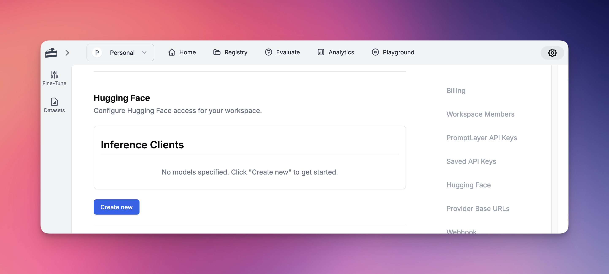
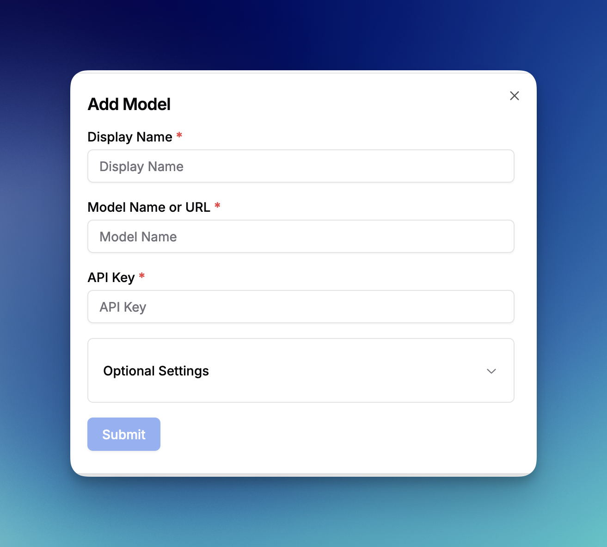
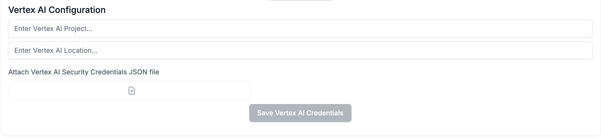

PromptLayer works seamlessly with many popular LLM frameworks and abstractions.

Don't see the integration you are looking for? [Email us!](mailto:hello@promptlayer.com) 👋

## LiteLLM

[LiteLLM](https://github.com/BerriAI/litellm) allows you to call any LLM API all using the OpenAI format. This is the easiest way to swap in and out new models and see which one works best for your prompts. Works with models such as Anthropic, HuggingFace, Cohere, PaLM, Replicate, Azure.

Please read the [LiteLLM documentation page](https://docs.litellm.ai/docs/observability/promptlayer_integration)

## LlamaIndex 

[LlamaIndex](https://www.llamaindex.ai/) is a data framework for LLM-based applications. Read more about our integration on the [LlamaIndex documentation page](https://docs.llamaindex.ai/en/stable/module_guides/observability/observability.html#promptlayer)

## Hugging Face

PromptLayer supports integration with [Hugging Face](https://huggingface.co/models), allowing you to use any model available on Hugging Face within the platform. To set up:

1. Go to Settings
2. Navigate to the Hugging Face section
3. Click "Create New"

Once configured, you can use Hugging Face models throughout the platform, including:

- Prompt Registry
- Evaluations
- All other platform features

## Amazon Bedrock

PromptLayer supports integration with [Amazon Bedrock](https://aws.amazon.com/bedrock/), AWS's fully managed service for accessing foundation models. Amazon Bedrock provides access to models from leading AI companies including Anthropic, Cohere, Meta, and Amazon's own Titan models. To set up:

1. Go to Settings
2. Navigate to the Amazon Bedrock section
3. Enter your AWS Access Key ID
4. Enter your AWS Secret Access Key
5. Select your AWS Region (e.g., us-east-1, us-west-2)
6. Click "Save Bedrock Credentials"

Once configured, you can access a wide range of model families through Bedrock, including:

- **Anthropic Claude** models (Claude 3 Opus, Sonnet, Haiku, and Claude 2)
- **Amazon Titan** models (Titan Text, Titan Embeddings, Titan Image)
- **Meta Llama** models (Llama 2 and Llama 3 variants)
- **Cohere** models (Command and Embed)
- **Mistral AI** models (Mistral and Mixtral)
- And more as they become available on Bedrock

All Bedrock models are available throughout the platform, including:
- Prompt Registry for template management
- Evaluations for testing and comparison
- Playground for experimentation
- All other platform features

Note: Ensure your AWS IAM user has the necessary permissions to invoke Bedrock models in your selected region.

## Vertex AI

PromptLayer supports integration with [Google Cloud Vertex AI](https://cloud.google.com/vertex-ai), allowing you to use both Google's foundation models and your own custom-deployed models. 

### Standard Models

To set up Vertex AI for standard models:

1. Go to Settings
2. Navigate to the Vertex AI section
3. Enter your Vertex AI Project ID
4. Enter your Vertex AI Location (e.g., us-central1)
5. Attach your Vertex AI Security Credentials JSON file
6. Click "Save Vertex AI Credentials"

Once configured, you can use Vertex AI foundation models including:

- Gemini models (gemini-pro, gemini-pro-vision, gemini-1.5-pro, etc.)
- Claude models (claude-3-sonnet, claude-3-haiku, claude-3-opus, etc.)
- PaLM models (text-bison, chat-bison, etc.)

### Custom Models

Vertex AI also supports deploying and using your own custom models. This allows you to:

- Deploy fine-tuned versions of foundation models
- Use models from Model Garden
- Deploy custom-trained models from your ML pipelines
- Access specialized domain-specific models

To use custom models:

1. Deploy your model to a Vertex AI endpoint in your project
2. In PromptLayer Settings, navigate to Custom Models
3. Click "Create Custom Model"
4. Select "Vertex AI" as the provider
5. Enter your model endpoint details:
   - **Endpoint ID**: The deployed model endpoint identifier
   - **Model Name**: The specific model version or identifier
   - **Display Name**: A friendly name for use in PromptLayer
6. Configure any model-specific parameters

Custom Vertex AI models are fully integrated with all platform features including Prompt Registry, Evaluations, and request tracking.

