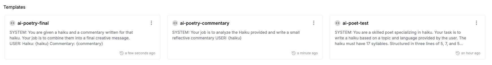

<Tip>
  This module requires a prompt to be used, so ensure you have one set up in
  your PromptLayer account before proceeding.
</Tip>

**Agentic Workflows** allow you to automate complex tasks by chaining multiple prompts together so that the output from one prompt serves as the input for the next. This approach streamlines processes and minimizes manual intervention.

**Example Workflow: The AI Poet Journey**

Imagine you want to create a creative process that generates a poetic journey:

- First, an **ai-poet** prompt generates a haiku based on a user-provided topic.
- Next, a second prompt takes that haiku as inspiration and produces a reflective commentary.
- Finally, a third prompt combines the haiku and the commentary to craft a final artistic message.

By saving these prompts and chaining them into an agent, you ensure consistency in tone and style while automating the creation of a multi-layered piece of content. This allows you to experiment with creative outputs, measure engagement, and easily rollback to earlier versions if needed.

## Import or Create Multiple Prompts

Gather the prompts required for your workflow. For the AI Poet Journey, you might use:

- The original **ai-poet** prompt that generates a haiku that we've already created during [**Getting Started**](/onboarding-guides/getting-started).
- An additional prompt that generates commentary based on the haiku.
- Optionally, a prompt that compiles the haiku and commentary into a final creative message.

**Step by Step:**

1. Open your Prompt Registry.
2. To add an existing prompt, select it from the list; or click the **Create Prompt** button to start a new one.
3. Verify that each prompt includes the necessary input variables and configuration.
4. Organize your prompts in the order you intend them to run.

To read more about creating and managing prompts, visit the [Prompt Management](/onboarding-guides/prompt-management) guide.

---

## Create an Agent That Runs Prompts Sequentially

Construct an agent to execute your chained prompts one after the other, ensuring smooth data flow between steps.

**Step by Step:**

1. Navigate to the **Agents** page: **Registry** -> **Agents**.
2. Click the **Create Agent** button.
3. Add Nodes to your agent by clicking the **Add Node** button.
4. Select Node Type as **Prompt**.
5. Select the **ai-poet** prompt you created in the previous step.
6. Do the same for the **ai-poetry-commentary** and **ai-poetry-final** prompts.
7. Arrange the prompts in the desired sequence. For example:

   1. First, generate the haiku.
   2. Next, generate commentary from the haiku.
   3. Finally, compile the final artistic message.

8. Confirm the order and save your agent configuration.

<video controls>
  <source src="./videos/create-agent.mp4" type="video/mp4" />
</video>

To learn more about agents, visit the [Agents](/why-promptlayer/agents) page.

---

## Enter Input Variables and Run the Agent

Customize your agent by specifying input variables for each prompt. Running the agent is valuable because it automates the entire workflow—processing each step in sequence to generate a complete, integrated output. This saves time and allows you to see the end-to-end effect of your changes, such as how a haiku and its commentary combine to form a final creative piece.

**Step by Step:**

1. Open the agent editor and locate the input variables section.
2. Enter or update the required input values for each prompt (for example, the topic for the haiku and any parameters needed for the commentary).
3. Save your changes and execute the agent.
4. Review the output to ensure the entire workflow functions as expected, and adjust the input values if needed.

<video controls>
  <source src="./videos/run-agent.mp4" type="video/mp4" />
</video>

---

**Additional Resources:**

- For more on agentic workflows, visit the [Agentic Workflows](/why-promptlayer/agents) page.
