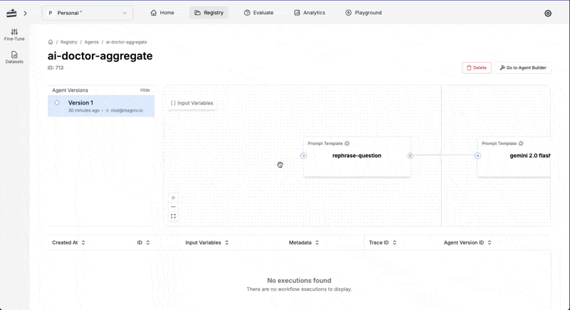

<Tip>
  This module requires an existing prompt in your PromptLayer account. Please
  follow the [Getting Started](/onboarding-guides/getting-started) guide to
  create one if needed.
</Tip>

Agents are sequenced chains of prompts and workflows that can be versioned, monitored, and iterated on from within PromptLayer.

## Example Use Cases

If you are having trouble creating a reliable prompt, it is often helpful to break the problem down into a few smaller prompts. The chaining and business logic that connects these smaller prompts will be considered an agent.

For example, if we are building an AI doctor, it might be helpful to split this into a few individual prompts for appointment scheduling, surgery preparation, and questions about medicine. You might even want to run a prompt on multiple LLM models from OpenAI, Anthropic, and Google, and then use the outputs to create a final answer.

Agents are ideal for:

- **LLM Model Synthesis**: Gathering insights from multiple medical and choosing the best possible answer.
- **Data Processing Pipelines**: Refining, filtering, or transforming data using multiple models in sequence.
- **Complex Support Automation**: Automating logical decision-making across different models to allow for unit testing and deterministic results.

## Create an Agent

### Start with Multiple Prompts

Gather the prompts required for your agent. Refer to the [Getting Started Guide](/onboarding-guides/getting-started) to learn how to create new prompts.

In this example, we will create a an AI doctor that is comprised of 3 prompts.

1. The "rephrase-question" prompt will refine a question for better clarity.
2. The "ai-doctor" prompt will analyze the user's symptoms and provides a diagnosis.
3. The "choose-best-answer" prompt will select the best response from a list. We will run #2 on multiple different models to get the best result.

========ADD PROMPTS HERE!!!!

### Build the Agent

Construct an agent to execute your chained prompts one after the other.

This agent will take in a user query, rephrase it to something more specific, run the enriched question through the AI doctor prompt multiple times, and then return the best result.

1. Navigate to **Registry → Agents**.
2. Click **Create Agent**.
3. Set up input variables. Click on **Input Variables** in the top left, and add `user_question`. Here we can also add a sample value for testing purposes: "Why does my stomach hurt?"
4. Create the first agent step that will take in the user query and rephrase it to something more detailed.
  - Name the step: "Enriched Question".
  - Click **Add Node** and set Node Type to **Prompt Template**.
  - Select the previously created "rephrase-question" prompt.
  - Match the input variable `user_question` to the input variable in the prompt.
5. Run the AI doctor. Create 3 more steps that use the "ai-doctor" prompt. These steps should all be connected to our first "Enriched Question" node.
   - To change the model, select "ai-doctor" and click the pencil icon next to the model engine.
6. Combine the three answers. Use node type: "Combine". Connect the 3 parallel AI doctor nodes to this combination step.
7. Create a final node called "Best Answer" using the prompt "choose-best-answer". Connect it to the combination node created previously.
8. Mark the "Best Answer" node as an "Output Node" by clicking the three dots on the node. The output node is the final node to run in an agent and will be treated as the "return" statement.
7. Try clicking "Run" to test it and don't forget to **Save** the configuration!

<video controls>
  <source src="./videos/create-agent.mp4" type="video/mp4" />
</video>

---

### Enter Input Variables and Run the Agent

In the editor view, you can run agent workflows with test input variables.

1. Open the agent editor and locate the input variables section **at the top left of the editor panel**.
2. Enter or update the required input values for each prompt.
3. Save your changes and **Run** the agent.
4. Review the output to ensure the entire workflow functions as expected, and adjust the input values if needed.

<video controls>
  <source src="./videos/run-agent.mp4" type="video/mp4" />
</video>

---

## Agent Tracing

Traces are a powerful feature in PromptLayer that allow you to monitor and analyze the execution flow of your applications, including LLM requests.

To see the traces for an agent:

1. Open the sidebar on the left and select Traces.
2. Click on the agent name to see the traces for the agent.

**Additional Resources:**

- [Learn more about agents](/why-promptlayer/agents).
- [Add tracing](/running-requests/traces) to your agents.
