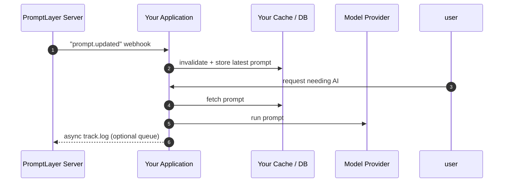

PromptLayer fits into your stack at three levels of sophistication:

1. **`promptlayer_client.run`** – zero-setup SDK sugar
2. **Webhook-driven caching** – maintain local cache of prompt templates
3. **Managed Agents** – let PromptLayer orchestrate everything server-side


<Frame>

</Frame>

---

# Use `promptlayer_client.run` (quickest path)

When every millisecond of developer time counts, call `promptlayer_client.run()` directly from your application code.
1. Fetch latest prompt – We pull the template (by version or release label) from PromptLayer.
2. Execute – The SDK sends the populated prompt to OpenAI, Anthropic, Gemini, etc.
3. Log – The raw request/response pair is saved back to PromptLayer.

<CodeGroup>

```python Python
from promptlayer import PromptLayer
pl_client = PromptLayer(api_key="...")

response = pl_client.run(
    prompt_name="order-summary",
    input_variables={"cart": cart_items},
    prompt_release_label="prod"
)
````

```js JavaScript
import { PromptLayer } from "promptlayer";
const plClient = new PromptLayer({ apiKey: "..." });

const response = await plClient.run({
  promptName: "order-summary",
  inputVariables: { cart: cartItems },
  promptReleaseLabel: "prod"
});
```

</CodeGroup>

**Under the hood**

1. SDK pulls the latest prompt (or the version/label you specify).
2. Your client calls the model provider (OpenAI, Anthropic, Gemini, …).
3. SDK writes the log back to PromptLayer.

> 💡 **Tip** – If latency is critical, enqueue the log to a background worker and let your request return immediately.
---

# Cache prompts with Webhooks

Eliminate the extra round‑trip by **replicating prompts into your own cache or database**.

PromptLayer keeps that cache fresh through webhook events—no polling required.




### Step‑by‑step

1. **Subscribe to webhooks in the UI**

Read more here about webhooks [here](/onboarding-guides/webhooks).

2. **Maintain a local cache**

```python
# pseudocode
def handle_pl_webhook(event):
    prompt = event["data"]
    db.prompts.upsert(prompt["prompt_template_name"], prompt)
```

3. **Serve traffic**

```python
prompt = db.prompts.get("order-summary")
llm_response = openai.chat.completions.create(...)
queue.enqueue(track_to_promptlayer, llm_response)
```

> **Tip:** Most teams push the track_to_promptlayer onto a Redis or SQS queue so as to not block on the logging of a request.

Read the full guide: **[PromptLayer Webhooks ↗](/onboarding-guides/webhooks)**

---

# Run fully-managed Agents

For complex workflows requiring orchestration, use PromptLayer's managed agent infrastructure.

### How it works
1. Define multi-step workflows in PromptLayer's Agent Builder
2. Trigger agent execution via API
3. Monitor execution on PromptLayer servers
4. Receive results via webhook or polling

PromptLayer handles all orchestration, parallelization, and model provider communication.


### Implementation

<CodeGroup>

```python Python
from promptlayer import PromptLayer
promptlayer_client = PromptLayer(api_key="…")

execution = promptlayer_client.run_workflow(  # SDK method
    workflow_name="customer_support_agent",   # <- this is an Agent
    workflow_label_name="prod",
    input_variables={"ticket_id": 123}
)
```

```ts JavaScript
import { PromptLayer } from "promptlayer";
const promptlayer_client = new PromptLayer({ apiKey: "…" });

const execution = await promptlayer_client.runWorkflow({
  workflowName: "customer_support_agent",    // <- this is an Agent
  workflowLabelName: "prod",
  inputVariables: { ticket_id: 123 }
});

```
</CodeGroup>

Because execution is server-side, you inherit centralized tracing, cost analytics, and secure sandboxed tool-nodes without extra ops.

Learn more: **[Agents documentation ↗](/why-promptlayer/agents)**

---

## Which pattern should I pick?

| Requirement                 | `promptlayer_client.run` | Webhook Cache | Managed Agent |
| --------------------------- | :----------------------: | :-----------: | :-----------: |
| ⏱️ *extreme latency reqs*   |             ❌            |       ✅       |       ✅       |
| 🛠 *Single LLM call*        |             ✅            |       ✅       |       ➖       |
| 🌩 *Complex plans / tools*  |             ➖            |       ➖       |       ✅       |
| 👥 *Non-eng prompt editors* |             ✅            |       ✅       |       ✅       |
| 🧰 *Zero ops overhead*      |             ✅            |       ➖       |       ✅       |

---

## Further reading 📚

* **Quickstart** – [Your first prompt](/quickstart)
* **Webhooks** – [Events & signature verification](/onboarding-guides/webhooks)
* **Zero Downtime Deploys** – [Deploy new variables safely](/onboarding-guides/zero-downtime-deploys)
* **Agents** – [Concepts & versioning](/why-promptlayer/agents)
* **Evaluation** – [Building evaluation pipelines](/features/evaluations/getting-started)

---

> ✉️ **Need a hand?** Ping us in Discord or email [hello@promptlayer.com](mailto:hello@promptlayer.com)—happy to chat architecture!