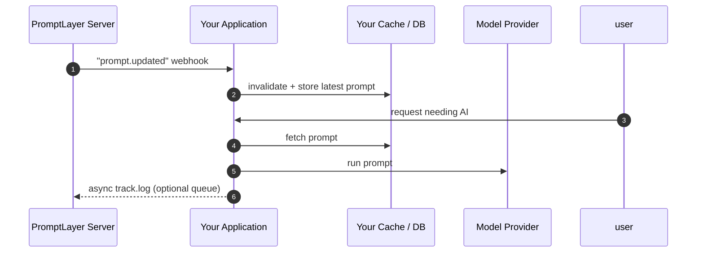
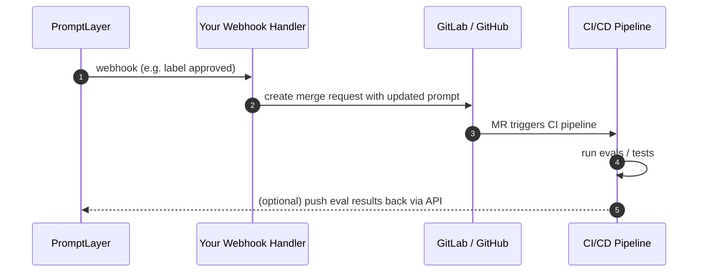

PromptLayer fits into your stack at four levels of sophistication:

1. **`promptlayer_client.run`** – zero-setup SDK sugar  
2. **Webhook-driven caching** – maintain local cache of prompt templates
3. **GitOps with Webhooks** – keep Git as your source of truth with bi-directional sync
4. **Managed Workflows** – let PromptLayer orchestrate everything server-side  


<Frame>

</Frame>

---

# Use `promptlayer_client.run` (quickest path)

When every millisecond of developer time counts, call `promptlayer_client.run()` directly from your application code.

<CodeGroup>

```python Python
from promptlayer import PromptLayer
pl_client = PromptLayer(api_key="...")

response = pl_client.run(
    prompt_name="order-summary",
    input_variables={"cart": cart_items},
    prompt_release_label="prod"
)
````

```js JavaScript
import { PromptLayer } from "promptlayer";
const plClient = new PromptLayer({ apiKey: "..." });

const response = await plClient.run({
  promptName: "order-summary",
  inputVariables: { cart: cartItems },
  promptReleaseLabel: "prod"
});
```

</CodeGroup>

**Under the hood**

1. Fetch latest prompt – We pull the template (by version or release label) from PromptLayer.
2. Execute – The SDK sends the populated prompt to OpenAI, Anthropic, Gemini, etc.
3. Log – The raw request/response pair is saved back to PromptLayer.--- 

# Cache prompts with Webhooks 

Eliminate the extra round‑trip by **replicating prompts into your own cache or database**.

PromptLayer keeps that cache fresh through webhook events—no polling required.


```mermaid
sequenceDiagram
  autonumber
  participant PL as PromptLayer Server
  participant APP as Your Application
  participant DB as Your Cache / DB
  participant LLM as Model Provider

  PL->>APP: "prompt.updated" webhook
  APP->>DB: invalidate + store latest prompt
  user->>APP: request needing AI
  APP->>DB: fetch prompt
  APP->>LLM: run prompt
  APP-->>PL: async track.log (optional queue)
```


### Step‑by‑step

1. **Subscribe to webhooks in the UI**

Read more here about webhooks [here](/features/prompt-registry/webhooks).

2. **Maintain a local cache**

```python
# pseudocode
def handle_pl_webhook(event):
    prompt = event["data"]
    db.prompts.upsert(prompt["prompt_template_name"], prompt)
```

3. **Serve traffic**

```python
prompt = db.prompts.get("order-summary")
llm_response = openai.chat.completions.create(...)
queue.enqueue(track_to_promptlayer, llm_response)
```

> 💡 **Tip:** Most teams push the track_to_promptlayer onto a Redis or SQS queue so as to not block on the logging of a request.

Read the full guide: **[PromptLayer Webhooks ↗](/features/prompt-registry/webhooks)**

---

# GitOps with Webhooks

For teams that want **Git as the source of truth** for prompts, webhooks enable a full bi-directional sync between PromptLayer and your repository. This is the recommended pattern for teams with existing CI/CD pipelines (GitHub Actions, GitLab CI, etc.) that want prompt changes to go through the same review and deploy process as code changes.

### Change starts on PromptLayer

When someone edits a prompt or approves a release label in PromptLayer, a webhook fires to your system. Your webhook handler creates a merge request (or pull request) in your repo with the updated prompt. From there, your normal CI/CD pipeline takes over — code review, automated evals, deploy.

Key webhook events for this flow:
- `prompt_template_version_created` – a new version of a prompt was saved
- `prompt_template_label_moved` – a release label (e.g. `prod`) was moved to a new version
- `prompt_template_label_change_approved` – a protected release label change was approved

See the full list of events in the [Webhooks docs](/features/prompt-registry/webhooks).


```mermaid
sequenceDiagram
  autonumber
  participant PL as PromptLayer
  participant WH as Your Webhook Handler
  participant GIT as GitLab / GitHub
  participant CI as CI/CD Pipeline

  PL->>WH: webhook (e.g. label approved)
  WH->>GIT: create merge request with updated prompt
  GIT->>CI: MR triggers CI pipeline
  CI->>CI: run evals / tests
  CI-->>PL: (optional) push eval results back via API
```

### Change starts in code

When an engineer updates a prompt directly in the repo, your CI/CD pipeline can publish it back to PromptLayer using the REST API or SDK. This keeps PromptLayer in sync without any manual steps.

<CodeGroup>

```python Python
from promptlayer import PromptLayer
pl_client = PromptLayer(api_key="...")

# In your CI/CD pipeline after prompt file changes
pl_client.templates.publish(
    prompt_name="order-summary",
    prompt_template="Your updated prompt template here",
)
```

```bash GitLab CI / GitHub Actions
# Example CI step — publish prompt to PromptLayer
curl -X POST https://api.promptlayer.com/prompt-templates \
  -H "X-API-KEY: $PROMPTLAYER_API_KEY" \
  -H "Content-Type: application/json" \
  -d @prompts/order-summary.json
```

</CodeGroup>

### Closing the loop with eval results

If your CI/CD pipeline runs evaluations as part of the deploy process, you can push those results back to PromptLayer so everything is visible in one place. This means your team doesn't lose observability just because the deploy happened outside of PromptLayer.

> 💡 **Tip** – Combine this with [protected release labels](/features/prompt-registry/release-labels) and approval workflows so that a prompt change in PromptLayer requires approval before the webhook fires and the MR is created.

---

# Run fully-managed Workflows

For complex pipelines requiring orchestration, use PromptLayer's managed workflow infrastructure.

### How it works
1. Define multi-step workflows in PromptLayer's Workflow Builder
2. Trigger workflow execution via API
3. Monitor execution on PromptLayer servers
4. Receive results via webhook or polling

PromptLayer handles all orchestration, parallelization, and model provider communication.


### Implementation

<CodeGroup>

```python Python
from promptlayer import PromptLayer
promptlayer_client = PromptLayer(api_key="…")

execution = promptlayer_client.run_workflow(  # SDK method
    workflow_name="customer_support_workflow",
    workflow_label_name="prod",
    input_variables={"ticket_id": 123}
)
```

```ts JavaScript
import { PromptLayer } from "promptlayer";
const promptlayer_client = new PromptLayer({ apiKey: "…" });

const execution = await promptlayer_client.runWorkflow({
  workflowName: "customer_support_workflow",
  workflowLabelName: "prod",
  inputVariables: { ticket_id: 123 }
});

```
</CodeGroup>

Because execution is server-side, you inherit centralized tracing, cost analytics, and secure sandboxed tool-nodes without extra ops.

Learn more: **[Workflows documentation ↗](/why-promptlayer/workflows)**

---

## Which pattern should I pick?

| Requirement                 | `promptlayer_client.run` | Webhook Cache | GitOps | Managed Workflow |
| --------------------------- | :----------------------: | :-----------: | :----: | :-----------: |
| ⏱️ *extreme latency reqs*   |             ❌            |       ✅       |   ➖   |       ✅       |
| 🛠 *Single LLM call*        |             ✅            |       ✅       |   ✅   |       ➖       |
| 🌩 *Complex plans / tools*  |             ➖            |       ➖       |   ➖   |       ✅       |
| 👥 *Non-eng prompt editors* |             ✅            |       ✅       |   ✅   |       ✅       |
| 🧰 *Zero ops overhead*      |             ✅            |       ➖       |   ➖   |       ✅       |
| 🔀 *Git as source of truth* |             ➖            |       ➖       |   ✅   |       ➖       |
| 🔁 *Bi-directional sync*    |             ➖            |       ➖       |   ✅   |       ➖       |

---

## Further reading 📚

* **Quickstart** – [Your first prompt](/quickstart)
* **Webhooks** – [Events & signature verification](/features/prompt-registry/webhooks)
* **Workflows** – [Concepts & versioning](/why-promptlayer/workflows)
* **CI for prompts** – [Continuous Integration guide](/features/evaluations/continuous-integration)

---

> ✉️ **Need a hand?** Ping us in Discord or email [hello@promptlayer.com](mailto:hello@promptlayer.com)—happy to chat architecture!
