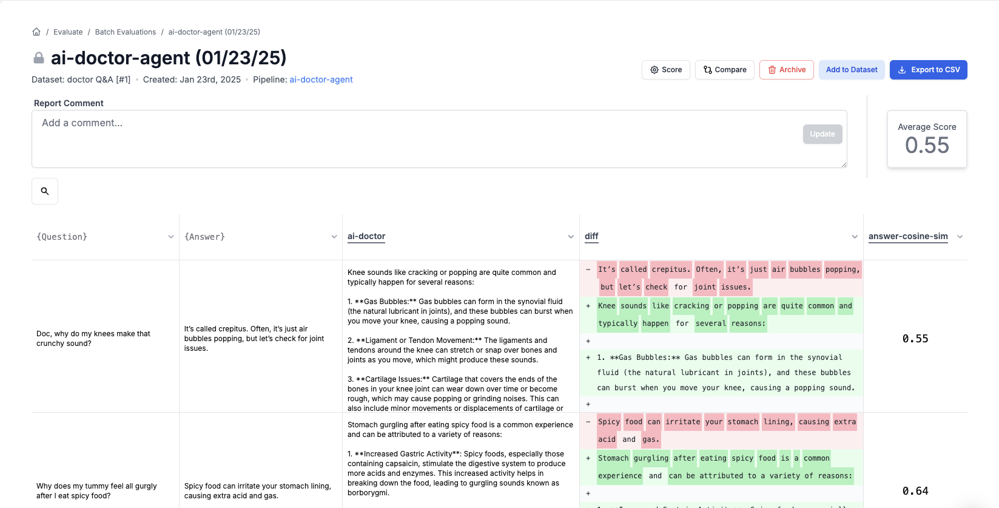

<Tip>
  This module requires a prompt to be used, so ensure you have one set up in
  your PromptLayer account before proceeding. Use the [Getting
  Started](/onboarding-guides/getting-started) guide to create a prompt.
</Tip>

Evaluating your prompts is essential to ensure they perform as expected before deploying them in production. For example, you might use an **ai-poet** prompt to generate creative haikus based on a given topic, allowing you to assess creativity, syllable accuracy, and overall engagement. Similarly, if you're using an **ai-doctor-agent** prompt to provide diagnostic suggestions based on patient data, evaluation can reveal which input parameters yield more accurate and cost-effective results. The same evaluation process applies across different prompt types, helping you optimize performance and make data-driven improvements.

## Import or Create Test Datasets

A well-prepared dataset provides the necessary context for evaluating your prompts. For the ai-poet prompt, you might use a dataset of various topics or historical haiku outputs. For an ai-doctor-agent, you could use patient data samples or historical diagnostic records.

**Step by Step:**

1. Click **Datasets** in the left sidebar. ([Read more](/features/evaluations/datasets))
2. Click the **Create Dataset** button.
   1. If you have a .csv file, upload it or (Optional) download example datasets provided by PromptLayer.
   2. Otherwise, click on **Add Column**.
   3. Add rows by clicking the **Add Row** button.
   4. Optionally, add data from your request history by clicking **Add from Request History**.
3. Click the **Save as New Version** button.
   <video controls>
     <source src="./videos/create-dataset.mp4" type="video/mp4" />
   </video>

---

## Configure Evaluation Metrics and Scoring Criteria

Setting clear metrics is critical to objectively assess prompt performance. For the ai-poet prompt, you might define metrics such as creativity, syllable count accuracy, and user engagement. For the ai-doctor-agent, you could measure diagnostic accuracy, response time, and cost efficiency.

**Step by Step:**

1. Click the **Evaluate** button.
2. Click the **New Batch Run** button.
3. Select a previously created dataset and enter a name for your evaluation.
4. Click **Create Pipeline**.
5. Add steps to evaluate your prompt, such as comparing generated outputs to a benchmark or calculating a performance score.
   <video controls>
     <source src="./videos/run-eval.mp4" type="video/mp4" />
   </video>

---

## Run Evaluation

Executing the evaluation process generates actionable insights across all types of prompts. For instance, with an **ai-poet** prompt, evaluation might reveal which topics yield better haikus. In contrast, with an **ai-doctor-agent** prompt, the evaluation might show which patient data inputs lead to more accurate diagnostic recommendations. Running the **full batch** means executing the evaluation for the **entire dataset file**, allowing you to review comprehensive performance data and make informed adjustments.

For more examples, check out the [Evaluation Examples](/features/evaluations/examples) page.

**Step by Step:**

1. Click **Run Full Batch** to start the evaluation.
2. Examine the results:
   1. **Define scoring criteria** to objectively assess performance.
   2. **Compare results** across multiple runs to identify trends.
   3. **Analyze metrics** such as execution time, cost, and accuracy.
3. Use these insights to **optimize** and **refine** your prompt.
   

---

**Additional Resources:**

- For more on prompt creation, visit the [Quickstart](/quickstart).
- Learn more about evaluating prompt performance on the [Evaluation](/features/evaluations/overview) page.
