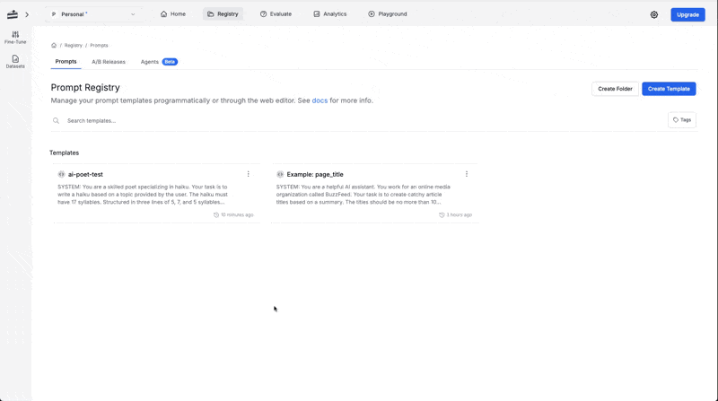

To effectively use PromptLayer, you need a **prompt** that defines how your AI interacts with users. Creating a prompt allows you to set precise instructions for generating content, automating workflows, and ensuring consistent results.

### Understanding Prompts

A prompt is an instruction given to an AI model to guide its response. Well-structured prompts:

- Define **expected behavior** to control AI outputs.
- Use **input variables** to make responses predictable.
  - Input Variables are the data you feed into a prompt. They can be text, numbers, or other information the prompt uses to produce the final result.

### Why Prompts Matter

Prompts shape how an AI responds. A well-crafted prompt ensures the model generates accurate, relevant, and useful results. Without clear instructions, the AI may produce vague, off-topic, or incorrect responses.

For example, a generic prompt like "Write poetry about the moon" might result in a broad and inconsistent response. However, a more specific prompt, such as "Write a haiku about the moon," directs the AI toward a precise and structured output.

Understanding how to structure prompts effectively allows users to maximize AI's potential, whether for research, automation, creative writing, or problem-solving.

**Breaking Down a Prompt**

Let's create a prompt that generates a haiku. To do this, we first need to understand its key components.

A prompt typically consists of a system message and a user message:

The system message sets the AI's role and behavior, much like opening a recipe book that defines how a dish should be prepared.

- In our example, the system message is designed to create a haiku:

```
You are a skilled poet specializing in haiku.
Your task is to write a haiku based on a topic provided by the user.
The haiku must have 17 syllables, structured in three lines of 5, 7, and 5.
```

The user message provides input variables, similar to selecting a recipe based on available ingredients

- In our example, the user message is the topic on which the haiku will be written:

```
{topic}
```

## Create a Prompt

1. Log in to your PromptLayer account.
2. Navigate to the **Prompt Registry**. ([Read more](/features/prompt-registry/overview))
3. Click the **Create Prompt** button to start a new prompt.
4. Fill in the required details such as the **Prompt Title**, **Messages**, and **Input Variables**. Use **f-string** or **jinja2** syntax to define input variables. ([Read more](/features/prompt-registry/overview#string-formats))
5. Select the **Model** and configure its **Parameters**.
6. Save your prompt by clicking on **Create Prompt**.

Watch the video below to see how to create a prompt:

<video controls>
  <source src="./videos/create-prompt.mp4" type="video/mp4" />
</video>

## Run a Prompt in the Playground

Testing your prompt in the **Playground** gives you immediate feedback on its performance. This interactive environment lets you see how the AI interprets your instructions and allows you to make adjustments to achieve better results.

1. Open your prompt from the PromptLayer dashboard.
2. Click the **Playground** button.
3. (Optional) Modify the prompt if you want to test new changes.
4. Execute the prompt by clicking the **Run** button or pressing "command + enter"
5. Observe the output in real time and adjust your prompt as needed.

   <video controls>
     <source src="./videos/run-playground.mp4" type="video/mp4" />
   </video>

## Review Prompt Logs

Reviewing prompt logs helps you monitor performance metrics such as execution time, cost, token usage, and model parameters. These insights enable you to identify areas for improvement and optimize your prompt for better results.

1. Open the sidebar on the left (if not already visible).
2. Click on **Requests** to access your log entries.
3. Use the available filters to locate the log for the specific prompt you want to review. ([Read more](/why-promptlayer/advanced-search))
4. Click on a log entry to view detailed information, such as execution time, cost, token usage, and model parameters.
5. Examine performance metrics (consider assigning a star rating or score) to identify top-performing requests.
6. Use these insights to refine and optimize your prompt.
   

**Additional Resources:**

- For more on prompt creation, visit the [Prompt Registry](/features/prompt-registry/overview) page.
- To learn more about running prompts, visit the [Running Prompts](/running-requests/promptlayer-run#run) guide.
