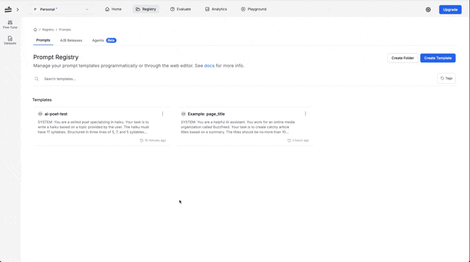

When buidling a prompt, logging becomes critical. For example, the [ai-poet prompt](/onboarding-guides/getting-started) generates a creative haiku based on a given topic, and enabling logging helps you monitor important performance details. For example, logging can reveal:

- **Execution Time:** How quickly the prompt is executed.
- **Token Usage:** The number of tokens used during execution, which directly impacts cost.
- **Cost Metrics:** Whether the prompt runs efficiently within your budget.

By reviewing these logs, you can determine if your ai-poet prompt is performing as expected and make adjustments if necessary—ensuring that your creative content is generated both efficiently and effectively.

**Step by Step:**

1. Enable logging in your application to capture detailed execution data.
2. Initialize the PromptLayer client with your API key and logging enabled.
3. Run the **ai-poet** prompt using the `pl_client.run` method, providing an input variable such as `{topic: "The Ocean"}`.
4. Review the generated logs to analyze metrics like execution time, token usage, and cost, then use these insights to fine-tune your prompt.

<CodeGroup>

```python Python

from promptlayer import AsyncPromptLayer

# Initialize the async PromptLayer client with your API key
async_promptlayer_client = AsyncPromptLayer(api_key="pl_****")
input_variables = {
   "topic": "The Ocean"
}

response = promptlayer_client.run(
prompt_name="ai-poet", input_variables=input_variables,
prompt_release_label="onboarding_guide",
tags=["onboarding_guide"], # Add tags
metadata={"user_id": "abc123"}) # Add metadata

print(response["raw_response"].choices[0].message.content)

# Add a score to the log
promptlayer_client.track.score(
   request_id=response["request_id"],
   score=100,
)
```

```js Javascript
import { PromptLayer } from "promptlayer";

const input_variables = {
  topic: "The Ocean",
};

const response = await promptLayerClient.run({
  promptName: "ai-poet",
  inputVariables: input_variables,
  promptReleaseLabel: "onboarding_guide",
  tags: ["onboarding_guide"], // Add tags
  metadata: { user_id: "abc123" }, // Add metadata
});

console.log(response["raw_response"].choices[0].message.content);

// Add a score to the log
await promptLayerClient.track.score({
  request_id: response["request_id"],
  score: 100,
});
```

</CodeGroup>

To read more about logging, check out the [Logging Metadata](/quickstart#logging-metadata) section of the Quickstart guide.

---

## Run and View Log

Review your logs to troubleshoot issues and gather performance metrics.

**Step by Step:**

1. Execute your prompt (via SDK or code).
2. Open the sidebar and click **Requests** to view log entries.
3. Use filters to locate the specific prompt log.
4. Click on the log entry to see execution time, cost, token usage, and more.
5. Assign a rating or score to highlight top-performing requests.
6. Use these insights to refine and optimize your prompt.



---

**Additional Resources:**

- For more on running prompts, visit the [Quickstart](/quickstart) guide.
- To learn more about SDKs, check out our [Python](/languages/python) and [Javascript](/languages/javascript) guides.
