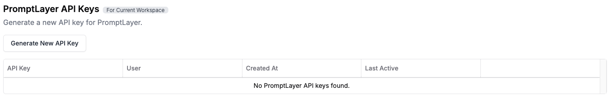

<Tip>
  This module requires a prompt to be used, so ensure you have one set up in
  your PromptLayer account before proceeding. Use the [Getting
  Started](/onboarding-guides/getting-started) guide to create a prompt.
</Tip>

To effectively manage your prompts in **PromptLayer**, you can version them for tracking changes and retrieve them to ensure consistent usage across your projects. In this guide, we explain how to save a new version of your prompt and pull the latest version programmatically.

## Save New Version

Keep track of prompt updates by saving them as new versions. This ensures you can compare different iterations, revert to an older version if needed, and maintain a clear history of changes.

**Example Scenario:**

During **[Getting Started](/onboarding-guides/getting-started)** we created an **ai-poet** prompt that writes a haiku about a specific topic. Initially, it just takes a single input variable for the topic:

- “You are a skilled poet specializing in haiku. Your task is to write a haiku based on a topic provided by the user.”

You decide to enhance it by allowing users to specify a language as well:

- Add a new input variable (e.g., `{lang}`) so the haiku can be written in multiple languages.
- Update the system prompt to instruct the AI to consider both the topic and the language.

By saving these edits as a **new version**, you can:

- **Compare** how users respond to the updated prompt (e.g., do they enjoy the multilingual option?).
- **Measure** any improvements in user satisfaction or engagement.
- **Rollback** to the old version if changes don't yield the desired results.

**How to save a new version:**

1. Log in to your PromptLayer account.
2. Navigate to the **Prompt Registry**.
3. Select the existing prompt you want to update (e.g., “Welcome Prompt”).
4. Click the **Edit Version #** button to modify the prompt’s content (tone, instructions, or additional variables).
5. Make your changes, such as adding friendlier text or clarifying the product’s key features.
6. Click **Update Template** to save these edits as a new version.
   <video controls>
     <source src="./videos/save-new-version.mp4" type="video/mp4" />
   </video>

By following these steps, you can keep a detailed history of your prompt’s evolution and quickly revert to an older version if necessary.

---

## Retrieve Your Prompts from Code

Fetch the latest version of your prompt from code, ensuring consistent usage in production.

**Step by Step:**

1. Obtain your **API Key** by going to **Settings** → **PromptLayer API Keys**.
   
2. Initialize the PromptLayer client in your application.
3. Call the appropriate function to retrieve your prompt.
4. Use the retrieved prompt in your logic.

<CodeGroup>

```python Python
from promptlayer import PromptLayer

pl_client = PromptLayer(api_key="YOUR_API_KEY")

template = pl_client.templates.get("your_prompt_name")
print(template)
```

```js Javascript
import { PromptLayer } from "promptlayer";

const promptLayerClient = new PromptLayer({ apiKey: "YOUR_API_KEY" });
const template = await promptLayerClient.templates.get("your_prompt_name");
console.log(template);
```

</CodeGroup>

**Example:**  
Imagine you're building an AI writing tool that dynamically generates content based on user input.
By retrieving the prompt directly from your code, your application automatically uses the most up-to-date version of the prompt.
This means that whenever you update the prompt in PromptLayer, your tool will immediately reflect those changes without any manual intervention, ensuring consistency and reducing maintenance overhead.

---

**Additional Resources:**

- For more on prompt creation, visit the [Quickstart](/quickstart).
- Learn more about the Prompt Registry in the [Documentation](/features/prompt-registry/overview).
