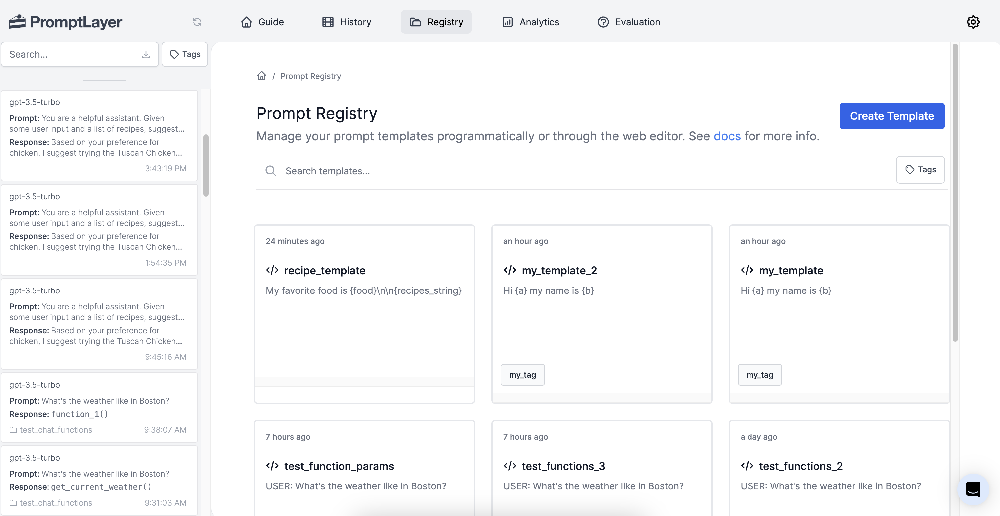
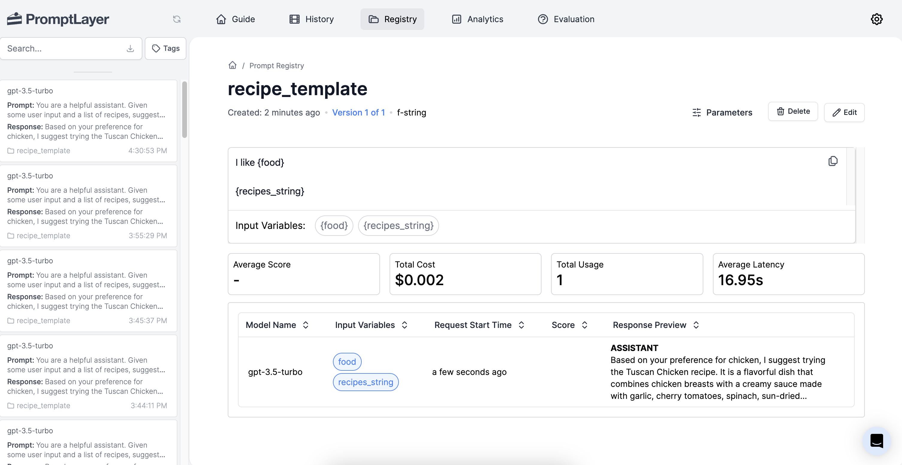
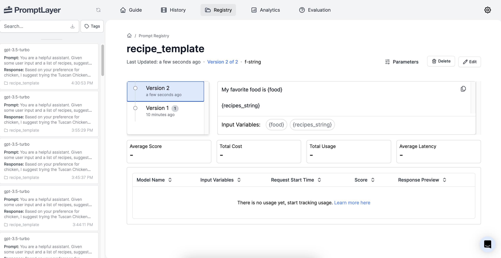

# Introduction

Have you ever spent way too long browsing recipes trying to find one that actually sounds good to you? Many of us have been there - endlessly scrolling through lists of recipes, hoping to chance upon one that matches our personal tastes. Unfortunately, most recipe sites take a one-size-fits-all approach, showing the same recipes to everyone without tailoring recommendations to individual preferences. This can make the process of finding a recipe you're excited to cook feel like finding a needle in a haystack.

The recipe recommendation engine described in this guide aims to solve these problems. By learning about each user's unique tastes, it can suggest recipes that are specifically tailored for that individual. No more wasting time manually searching through irrelevant recipes. This guide will walk through how to build an intelligent system that takes the effort out of recipe selection by providing personalized recommendations. With the right recommendation engine, discovering your next culinary masterpiece is merely a request away.

# Key Concepts

To enable personalized recipe recommendations, we will utilize two key technologies:

1. **Vector Database**: A vector is an array or list of numerical values representing a point in multi-dimensional space. We can represent recipes and ingredients as vectors capturing their attributes. A vector database will store these vectors, allowing quickly finding recipes that match a user's preferences based on vector similarity.
2. **Retrieval-Augmented Generation (RAG)**: This is a method that first fetches relevant data from a large database and then uses a language model to craft suitable responses or recommendations. For our recipe engine, RAG helps find the best recipes for a user and then presents tailored suggestions.

# Building Blocks

Creating a personalized recipe recommendation engine requires assembling the right combination of technologies to enable understanding user tastes, searching recipes effectively, and generating creative suggestions. We will leverage three key building blocks that each provide the necessary capabilities:

1. **OpenAI**: Used for generating vector representations (also referred to as "embeddings") of recipe texts. Additionally, OpenAI is also used to craft the final recipe suggestion for the user based on a list of recipes that match the user's query.
2. **Pinecone**: A vector database service that efficiently stores these embeddings.
3. **PromptLayer**: A platform that enables collaborative prompt engineering by allowing teams and individuals to
systematically track, debug, and optimize prompts for language models.

# Setting Up the Environment

To get started, visit the [GitHub repo](https://github.com/buckyroberts/Recipe-Recommender) for this project and
download the [data files](https://github.com/buckyroberts/Recipe-Recommender/tree/main/data). Each one contains a
recipe that we will use throughout the project.

Next, we need to set up the API keys for the services we will be using.

### OpenAI setup
1. Create an API key at https://platform.openai.com/account/api-keys
2. Save it as environment variable under `OPENAI_API_KEY`

### Pinecone setup
1. Create an API key at https://app.pinecone.io/
2. Save it as environment variable under `PINECONE_API_KEY`

### PromptLayer setup
1. Create an API key at https://promptlayer.com/home
2. Save it as environment variable under `PROMPTLAYER_API_KEY`

# Creating and Storing Recipe Embeddings

Now that we have our environment set up, our first goal will be to generate embeddings (vector representations) for each of our recipes. This process is done using OpenAI's embedding API. Before we jump into that though, let's get some housekeeping items out of the way.

This code imports necessary libraries, initializes OpenAI through PromptLayer. By initializing OpenAPI in this way, PromptLayer will act as a wrapper and will automatically log all requests to OpenAI.

```python
import os
from pathlib import Path
import pinecone
import promptlayer

openai = promptlayer.openai
```

Next we will set up our configurations for directories along with Pinecone's API key and index name. This will make the rest of our code more clear. It will also allow us to easily change our data directory location or index name if needed.

```python
BASE_DIR = Path(__file__).resolve().parent
DATA_DIR = BASE_DIR / 'data'
PINECONE_API_KEY = os.environ.get('PINECONE_API_KEY')
PINECONE_INDEX_NAME = 'recipes'
```

With that out of the way, we are now ready to connect to Pinecone. The code below first initializes Pinecone using our API key. It then checks if the desired Pinecone index already exists. If not, it creates a new index with the specified name.

```python
pinecone.init(api_key=PINECONE_API_KEY, environment='gcp-starter')

indexes = pinecone.list_indexes()
if PINECONE_INDEX_NAME not in indexes:
    pinecone.create_index(PINECONE_INDEX_NAME, dimension=1024, metric='euclidean')

index = pinecone.Index(PINECONE_INDEX_NAME)
```

With our index established, the code identifies all recipe files in the data directory and uses their filenames (minus the extension) as unique identifiers in Pinecone. Each recipe's content is read, converted into a vector representation using the OpenAI API, and then upserted into the Pinecone index, using the filename as its unique key.

```python
recipe_filepaths = [DATA_DIR / file for file in os.listdir(DATA_DIR) if file.endswith('.txt')]

for filepath in recipe_filepaths:
    base_name = os.path.basename(filepath)
    recipe_id, _ = os.path.splitext(base_name)

    with open(filepath, 'r') as file:
        recipe_content = file.read()
        recipe_embedding_response = openai.Embedding.create(
            input=recipe_content,
            engine='text-similarity-ada-001',
        )
        vector = recipe_embedding_response['data'][0]['embedding']
        index.upsert([(recipe_id, vector)])
```

Now that our database has been populated with recipes, we are ready to move onto the next step of building the recommendation engine!

# Building the Recommendation Engine

The code assigns the word 'chicken' to a variable named 'food' and then generates a vector representation of the word using OpenAI's embedding API.

```python
food = 'chicken'
food_embedding_response = openai.Embedding.create(
    input=food,
    engine='text-similarity-ada-001',
)
vector = food_embedding_response['data'][0]['embedding']
```

The code queries the Pinecone index to find the two most similar recipes to the 'chicken' vector and then retrieves the content of those recipes from the corresponding text files.

```python
query_results = index.query(
    vector=vector,
    top_k=2,
    include_values=True
)
recipe_ids = {i['id'] for i in query_results['matches']}
recipes_list = [open(DATA_DIR / f'{recipe_id}.txt', 'r').read() for recipe_id in recipe_ids]
```

The code retrieves a pre-defined prompt template from PromptLayer, populates it with the user's food preference and a list of matching recipes, sends this prompt to GPT-3.5-turbo to obtain a recipe suggestion.

```python
recipe_template = promptlayer.prompts.get('recipe_template')
recipe_template_template = recipe_template['template']

# Set our template variables
variables = {
    'food': food,
    'recipes_string': '\n\n'.join(recipes_list)
}

response, pl_request_id = openai.ChatCompletion.create(
    model='gpt-3.5-turbo',
    messages=[
        {
            'role': 'system',
            'content': (
                'You are a helpful assistant. '
                'Given some user input and a list of recipes, suggest one of the recipes. '
                'The final output should be the full recipe.'
            )
        },
        {
            'role': 'user',
            'content': recipe_template_template.format(**variables)
        },
    ],
    temperature=0.5,
    max_tokens=1024,
    return_pl_id=True
)
print(response.choices[0].message.content)
```

Associates the generated response with the specific prompt template in PromptLayer for tracking.

```python
promptlayer.track.prompt(
    request_id=pl_request_id,
    prompt_name='recipe_template',
    prompt_input_variables=variables
)
```

After running this script you will be able to see the results in PromptLayer.


# Improving Results with Prompt Engineering

Things are working, but let's tweak our prompt a bit to see if we can get some better results. Instead of `I like
{food}`, try using the text `My favorite food is {food}`.

This is a simple example of **prompt engineering**. The input we feed into OpenAI often needs to be tinkered with in
order to get the best results. And once we find an input that works well, we don't want to lose it, even as we continue
trying different prompts. Wouldn't it be nice if there was an easy way to keep track of all these prompts? Well lucky
for us, there is.

The Prompt Registry allows you to easily manage your prompt templates, which are customizable prompt strings with
placeholders for variables. Specifically, a prompt template is your prompt string with variables indicated in curly
brackets (`This is a prompt by {author_name}`).

### Creating prompt templates

Let's create a prompt template for our recipe app.



Here is an example of how you would create it in the UI.

<video controls="controls">
  <source src="/videos/registry.mp4" type="video/mp4" />
</video>

### Using prompt templates

Now let's update our application to use our new prompt template.

<CodeGroup>
```python suggestion.py
import os

import promptlayer

openai = promptlayer.openai
openai.api_key = os.getenv('OPENAI_API_KEY')

def suggest_final_recipe(prompt, recipes_list):
    """Given a prompt and a list of recipes, use GPT to suggest one of the recipes"""

    # Fetch our template from PromptLayer
    recipe_template = promptlayer.prompts.get('recipe_template')
    recipe_template_template = recipe_template['template']

    # Set our template variables
    variables = {
        'food': prompt,
        'recipes_string': '\n\n'.join(recipes_list)
    }

    response, pl_request_id = openai.ChatCompletion.create(
        model='gpt-3.5-turbo',
        messages=[
            {
                'role': 'system',
                'content': (
                    'You are a helpful assistant. '
                    'Given some user input and a list of recipes, suggest one of the recipes. '
                    'The final output should be the full recipe.'
                )
            },
            {'role': 'user', 'content': recipe_template_template.format(**variables)},
        ],
        temperature=0.5,
        max_tokens=1024,
        return_pl_id=True
    )
    print(response.choices[0].message.content)

    # Associate request with a prompt template
    promptlayer.track.prompt(
        request_id=pl_request_id,
        prompt_name='recipe_template',
        prompt_input_variables=variables
    )
```
</CodeGroup>



### Creating new versions

Great! Now any requests made using that prompt template are all in one location. Now let's try improving our prompt a
bit. Let's change `I like {food}` to `My favorite food is {food}`.

```python
import os

import promptlayer

openai = promptlayer.openai
openai.api_key = os.getenv('OPENAI_API_KEY')
promptlayer.api_key = os.environ.get('PROMPTLAYER_API_KEY')

template = {
    'input_variables': ['food', 'recipes_string'],
    'template': 'My favorite food is {food}\n\n{recipes_string}',
    'template_format': 'f-string',
}

promptlayer.prompts.publish("recipe_template", prompt_template=template)
```

Run the script to publish the updated template. When we publish a template with the same name, PromptLayer will create
a new version for us.



# Conclusion

Congratulations on completing the Recipe Recommender tutorial! You've successfully built a sophisticated system that
offers personalized recipe suggestions using the combined capabilities of OpenAI, Pinecone, and PromptLayer.

Through this tutorial, you've mastered generating vector representations of recipes with OpenAI, efficiently storing
and querying these vectors with Pinecone, and systematically optimizing language model prompts using PromptLayer.
This integration has empowered you to create a robust recipe recommendation system. Whether you're exploring culinary
inspirations or delving deep into AI technology, this guide has provided a rich blend of insights. Dive deeper,
experiment, and relish the limitless flavors of knowledge you can uncover. Bon appétit! 🍴🥘
