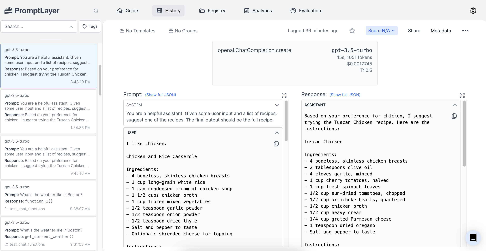
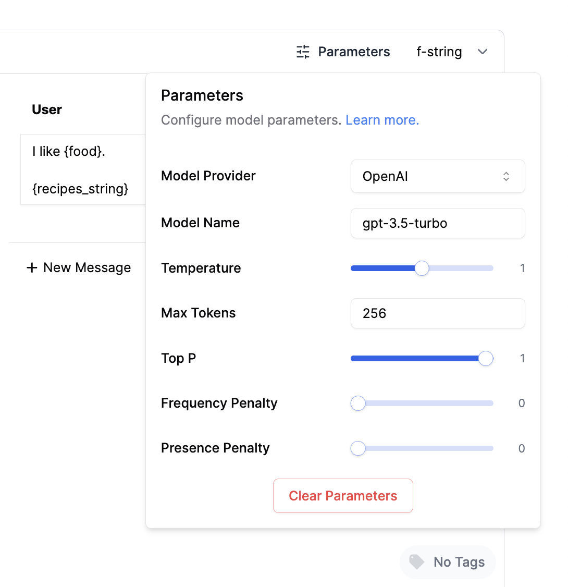
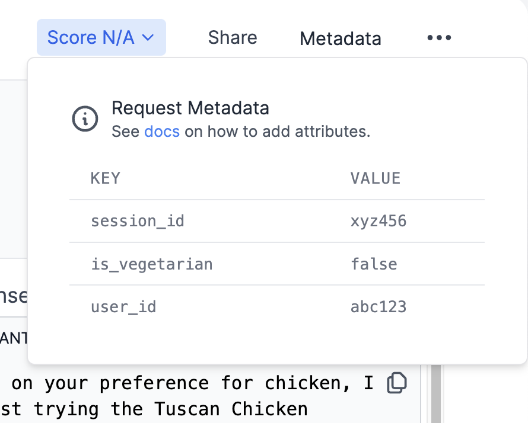

# Introduction

Have you ever spent way too long browsing recipes trying to find one that actually sounds good to you? We've all been there - endlessly scrolling through lists of recipes, hoping to stumble upon one that matches our personal tastes. Unfortunately, most recipe sites take a one-size-fits-all approach, showing the same recipes to everyone without tailoring recommendations to individual preferences. This can make the process of finding a recipe you're excited to cook feel like finding a needle in a haystack.

The recipe recommendation engine described in this guide aims to solve these problems. By learning about each user's unique tastes, it can suggest recipes that are specifically tailored for that individual. No more wasting time manually searching through irrelevant recipes. This guide will walk through how to build an intelligent system that takes the effort out of recipe selection by providing personalized recommendations. With the right recommendation engine, discovering your next culinary masterpiece is merely a request away.

# Key Concepts

To enable personalized recipe recommendations, we will utilize two key technologies:

1. **Vector Database**: A vector is an array or list of numerical values that represents a point in multi-dimensional space. Recipes and ingredients can be represented as vectors to capture their attributes. A vector database stores these vectors and enables quick searches for recipes that align with a user's preferences, based on vector similarity.
2. **Retrieval-Augmented Generation (RAG)**: This is a method that first fetches relevant data from a large database and then uses a language model to craft suitable responses or recommendations. For our recipe engine, RAG helps find the best recipes for a user and then presents tailored suggestions.

# Building Blocks

Creating a personalized recipe recommendation engine requires assembling the right combination of technologies to enable understanding user tastes, searching recipes effectively, and generating creative suggestions. We will leverage three key building blocks that each provide the necessary capabilities:

1. **OpenAI**: Used for generating vector representations (also referred to as "embeddings") of recipe texts. Additionally, OpenAI is used to craft the final recipe suggestion for the user based on a list of recipes that match the user's query.
2. **Pinecone**: A vector database service that efficiently stores these embeddings.
3. **PromptLayer**: A platform that enables collaborative prompt engineering by allowing teams and individuals to systematically track, debug, and optimize prompts for language models.

# Setting Up the Environment

To get started, visit the [GitHub repo](https://github.com/buckyroberts/Recipe-Recommender) for this project and
download the [data files](https://github.com/buckyroberts/Recipe-Recommender/tree/main/data). Each one contains a
recipe that we will use throughout the project.

Next, we need to set up the API keys for the services we will be using.

### OpenAI setup
1. Create an API key at https://platform.openai.com/account/api-keys
2. Save it as an environment variable under `OPENAI_API_KEY`

### Pinecone setup
1. Create an API key at https://app.pinecone.io/
2. Save it as an environment variable under `PINECONE_API_KEY`

### PromptLayer setup
1. Create an API key at https://promptlayer.com/home
2. Save it as an environment variable under `PROMPTLAYER_API_KEY`

# Generating Recipe Embeddings

With our environment set up, our first task is to generate embeddings (vector representations) for each recipe using OpenAI's embedding API. But before diving into that, there are a few preparatory steps to handle.

Let's start by first pulling in the necessary libraries and initializing OpenAI through PromptLayer. This setup ensures that every OpenAI request we make is automatically logged by PromptLayer.

```python
import os
from pathlib import Path
import pinecone
import promptlayer

openai = promptlayer.openai
```

Next we will set up our configurations for directories along with Pinecone's API key and index name. This will make the rest of our code more clear. It will also allow us to easily change our data directory location or index name if needed.

```python
BASE_DIR = Path(__file__).resolve().parent
DATA_DIR = BASE_DIR / 'data'
PINECONE_API_KEY = os.environ.get('PINECONE_API_KEY')
PINECONE_INDEX_NAME = 'recipes'
```

With that out of the way, we are now ready to connect to Pinecone. The code below first initializes Pinecone using our API key. It then checks if the desired Pinecone index already exists. If not, it creates a new index with the specified name.

```python
pinecone.init(api_key=PINECONE_API_KEY, environment='gcp-starter')

indexes = pinecone.list_indexes()
if PINECONE_INDEX_NAME not in indexes:
    pinecone.create_index(PINECONE_INDEX_NAME, dimension=1024, metric='euclidean')

index = pinecone.Index(PINECONE_INDEX_NAME)
```

With our index established, let's now retrieve a list of all recipe text files from the data directory. For each recipe, we'll read its content, convert it into a vector representation using the OpenAI API, and then upsert it into the Pinecone index using the filename (without the extension) as its unique ID.

```python
recipe_filepaths = [DATA_DIR / file for file in os.listdir(DATA_DIR) if file.endswith('.txt')]

for filepath in recipe_filepaths:
    base_name = os.path.basename(filepath)
    recipe_id, _ = os.path.splitext(base_name)

    with open(filepath, 'r') as file:
        recipe_content = file.read()
        recipe_embedding_response = openai.Embedding.create(
            input=recipe_content,
            engine='text-similarity-ada-001',
        )
        vector = recipe_embedding_response['data'][0]['embedding']
        index.upsert([(recipe_id, vector)])
```

Now that our database has been populated with recipes, we are ready to move onto the next step of building the recommendation engine!

# Querying Pinecone

The recommendation logic will operate by initially converting a food item the user is interested in into a vector. For the time being, to get things up and running, we can simply hardcode the value "chicken".

```python
food = 'chicken'
food_embedding_response = openai.Embedding.create(
    input=food,
    engine='text-similarity-ada-001',
)
vector = food_embedding_response['data'][0]['embedding']
```

Using our “chicken” vector, we can now query the Pinecone index to find the two most related recipes. For each result, we will extract the ID (filename) and then retrieve the content of the corresponding recipe from the text file.

```python
query_results = index.query(
    vector=vector,
    top_k=2,
    include_values=True
)
recipe_ids = {i['id'] for i in query_results['matches']}
recipes_list = [open(DATA_DIR / f'{recipe_id}.txt', 'r').read() for recipe_id in recipe_ids]
```

Now that we have user input referencing their food preference along with two related recipes, we can craft a prompt from these to feed into OpenAI.

# Creating a Prompt Template

The final goal of this project is to obtain a single recipe to recommend to the user. To accomplish this, we will first create a prompt template using PromptLayer. A prompt template is a customizable prompt string with placeholders for variables. When it comes to crafting prompts, prompt templates provide many benefits including reusability, built-in versioning, enhanced collaboration, and much more.

The Prompt Registry is where we can easily manage all of our prompt templates. The video below will show you how to create a prompt template via the Prompt Registry. We will structure our template to accept two variables, one for the users food preference and the other for the recipes.

<video controls="controls">
  <source src="/videos/recipes-create-template.mp4" type="video/mp4" />
</video>

Once our prompt template has been created, we can retrieve it from PromptLayer.

```python
recipe_template = promptlayer.prompts.get("recipe_template")
system_content = recipe_template['messages'][0]['prompt']['template']
user_content_template = recipe_template['messages'][1]['prompt']['template']
```

To use our template, we'll create a `variables` dictionary containing the values we want to pass in. Using these values, we'll construct the full prompt then pass it to OpenAI to obtain a recipe suggestion.

```python
variables = {
    'food': food,
    'recipes_string': '\n\n'.join(recipes_list)
}

response, pl_request_id = openai.ChatCompletion.create(
    model='gpt-3.5-turbo',
    messages=[
        {
            'role': 'system',
            'content': system_content
        },
        {
            'role': 'user',
            'content': user_content_template.format(**variables)
        },
    ],
    temperature=0.5,
    max_tokens=1024,
    return_pl_id=True
)
print(response.choices[0].message.content)
```

Lastly, we'll associate the generated response with this specific prompt template in PromptLayer for tracking.

```python
promptlayer.track.prompt(
    request_id=pl_request_id,
    prompt_name='recipe_template',
    prompt_input_variables=variables
)
```

After running this script you'll be able to see the final recipe suggestion in PromptLayer!



# Improving Results with Prompt Engineering

Things are working, but let's tweak our prompt a bit to see if we can get some better results. Instead of `I like {food}`, try using the text `My favorite food is {food}`.

This simple change in the phrasing of the prompt can significantly alter the response from the AI. Using more affirmative language like "My favorite food is" rather than just "I like" puts more emphasis on the user's preference. This signals to the AI that it should pay close attention to tailoring the suggestion to that specific food.

**Prompt engineering** involves systematically experimenting with different ways of phrasing the input prompt to find what works best. Some key aspects to tweak can include:
- Using more natural conversational language
- Providing additional context to guide the AI
- Emphasizing key information through wording
- Adjusting the tone, perspective, and personality

PromptLayer provides useful tools for prompt engineering. By centralizing prompt templates in the Prompt Registry, it makes it easy to track different versions of a prompt. And the analytics provide visibility into how well different prompts are performing.

This iterative process of refining prompts is crucial for getting the most out of AI systems. Even small tweaks can sometimes lead to significant improvements. Prompt engineering combines art and science to unlock the full potential of language models like GPT-3.

### Scoring Requests

PromptLayer also provides the ability to score the responses generated from each request. This allows tracking how well different prompt variations are performing over time. After making a request, you can assign it an integer score from 0 to 100 based on the quality of the response, where 100 is the best possible response and 0 is the worst.

By scoring the results of recipe recommendations, developers can measure the effectiveness of the prompts and the relevance of returned recipes. Higher scores can indicate that the recipes are closely aligned with user preferences, while lower scores can highlight the need for prompt optimization.

There are two ways to add scores to requests in PromptLayer:

**Via the Dashboard**

In the PromptLayer dashboard, you can view the log of all requests made. Here we will manually update the score field with a value ranging from 0 to 100 based on our assessment of the response quality.

<video controls="controls">
  <source src="/videos/recipes-add-score.mp4" type="video/mp4" />
</video>

**Programmatically**

You can also add scoring programmatically by calling the `score()` method after making a request:

```python
promptlayer.track.score(
   request_id=pl_request_id,
   score=(100 if food in response.choices[0].message.content else 0)
)
```

Scoring requests provide helpful analytics over time on how your prompts are performing. It enables sorting and filtering requests to surface the most effective prompts.

### Prompt Template Model Parameters

When editing a template from the UI, you can click on "Parameters" > "Set Parameters" to set values such as provider, model, and temperature on your prompt template.



You can now retrieve that metadata by using `include_metadata=True`. The function will then return a tuple containing both the prompt template and the metadata.

```python
recipe_template, metadata = promptlayer.prompts.get(
    "recipe_template",
    include_metadata=True
)
```

### Prompt Template Labels

To help organize and find prompt templates, we can add labels to them. Let's tag our latest template with a "prod" label to show that it is ready to use in production.

<video controls="controls">
  <source src="/videos/recipes-add-label.mp4" type="video/mp4" />
</video>

### Tracking Metadata

In addition to scoring, PromptLayer allows you to attach arbitrary metadata to each request. This metadata can be used to tag requests with contextual information like user IDs, session IDs, error codes, etc.

Metadata is helpful for advanced analysis and debugging of your prompt performance. You can quickly lookup requests associated with a specific user or error case. The analytics tab also allows for filtering and segmentation based on metadata values. Metadata can also provide additional context for each recommendation request, making it easier to debug issues or anomalies. For instance, if certain users consistently receive low-scoring recommendations, the associated metadata can help identify potential causes.

By attaching user-specific metadata (e.g., user ID, dietary preferences, geographical region), the system can further tailor recommendations to individual users, enhancing the personalization of recipe suggestions.

To add metadata to a request, use the `metadata()` method:

```python
promptlayer.track.metadata(
  request_id=pl_request_id,
  metadata={
     "user_id": "abc123",
     "session_id": "xyz456",
     "is_vegetarian": "false",
  }
)
```

The metadata will then appear in the PromptLayer dashboard for each request. You can click on any request to see its full metadata.



# Conclusion

Congratulations on completing the Recipe Recommender tutorial! You've successfully built a sophisticated system that
offers personalized recipe suggestions using the combined capabilities of OpenAI, Pinecone, and PromptLayer.

Through this tutorial, you've mastered generating vector representations of recipes with OpenAI, efficiently storing
and querying these vectors with Pinecone, and systematically optimizing language model prompts using PromptLayer.
This integration has empowered you to create a robust recipe recommendation system. Whether you're exploring culinary
inspirations or delving deep into AI technology, this guide has provided a rich blend of insights. Dive deeper,
experiment, and savor the limitless flavors of knowledge awaiting you. Bon appétit! 🍴🥘
