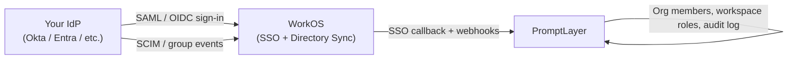

**Enterprise Identity** lets organization Owners connect PromptLayer to your corporate identity provider (IdP). Members sign in with **SSO** (SAML or OIDC via WorkOS), and user lifecycle changes from your IdP—create, update, group membership, deactivation—flow into PromptLayer through **Directory Sync** (SCIM).

Enterprise Identity is an **Enterprise feature**. [Contact us](mailto:hello@promptlayer.com) to enable it for your organization or self-hosted deployment.

## What it provides

- **Single sign-on (SSO)** — Sign in through Okta, Microsoft Entra ID, Google Workspace, or any SAML/OIDC IdP supported by [WorkOS](https://workos.com).
- **Directory Sync (SCIM)** — Provision and deprovision users and groups from your IdP without manual PromptLayer admin work.
- **Group-to-role mappings** — Map IdP groups to workspace roles so access stays in sync with your directory.
- **Sign-in policy** — Optionally require SSO for all org members while preserving an emergency access path for one Owner.
- **Audit log** — Org-scoped record of SSO events, SCIM changes, mapping updates, and access grants.

Enterprise Identity is **additive**. Users and organizations without it enabled continue to use email/password and social login unchanged.

## How it fits with RBAC

Enterprise Identity builds on [RBAC (Role-Based Access Control)](/why-promptlayer/rbac):

- **Enabling Enterprise Identity automatically enables RBAC** for that organization. Group mappings assign workspace roles (`Admin`, `Contributor`, `Publisher`, `Developer`), and deprovisioning respects role grants marked as identity-managed.
- **Disabling Enterprise Identity also disables RBAC** for that organization, returning it to the pre-enterprise state. Re-enable RBAC independently with your usual admin tools if you still need it.

Workspace permissions still come from roles. Enterprise Identity controls **who** is in the org and **which workspace roles** IdP group membership grants—not individual prompt or workflow ACLs.

## Architecture at a glance

PromptLayer does not host a custom SCIM endpoint. Directory events are delivered through WorkOS webhooks and processed into PromptLayer's org, workspace, and role tables.

## Who can configure it

Only **organization Owners** see the **Enterprise Identity** tab under **Organization Settings**. Members and non-Owners rely on SSO sign-in and IdP-driven access once the feature is configured.

The **Enterprise Identity** tab includes connection setup, sign-in policy, group mappings, emergency access, default workspace, and the audit log.

## Enabling Enterprise Identity

Enterprise Identity is toggled per organization by PromptLayer operators (cloud) or your platform team (self-hosted). It is not a self-serve dashboard toggle.

When enabled for an organization:

1. PromptLayer creates **identity settings** for the org and links a **WorkOS organization**.
2. **RBAC is turned on** if it was off.
3. An **emergency access Owner** is auto-designated if none exists.
4. Existing sessions may be invalidated when sign-in policy changes (see [Sign-in policy & break-glass](/why-promptlayer/enterprise-identity/sign-in-security)).

After enablement, Owners configure SSO and Directory Sync in the dashboard. See [Setup guide](/why-promptlayer/enterprise-identity/setup).

<Note>
Self-hosted deployments need WorkOS API credentials configured in the backend environment. Contact PromptLayer support for the required variables and webhook endpoints for your environment.
</Note>

## Typical rollout

<Steps>
  <Step title="Enable Enterprise Identity">
    PromptLayer or your platform team enables the feature for your organization.
  </Step>
  <Step title="Connect SSO">
    Open the WorkOS Admin Portal from **Organization Settings → Enterprise Identity**, configure your IdP, copy **Service provider details** from PromptLayer into your IdP, and run **Test SSO**. See [Setup](/why-promptlayer/enterprise-identity/setup).
  </Step>
  <Step title="Configure sign-in policy">
    Enable SSO, decide on JIT provisioning, and designate emergency access before turning on **Require SSO**. See [Sign-in policy & break-glass](/why-promptlayer/enterprise-identity/sign-in-security).
  </Step>
  <Step title="Connect Directory Sync">
    Enable SCIM in the WorkOS Admin Portal and assign groups in your IdP.
  </Step>
  <Step title="Map groups to workspace roles">
    Create group mappings so IdP group membership grants the right workspace access. See [Provisioning & access](/why-promptlayer/enterprise-identity/provisioning).
  </Step>
  <Step title="Set a default workspace (optional)">
    Choose where JIT-provisioned users land when no group mapping applies.
  </Step>
  <Step title="Monitor the audit log">
    Review SSO and SCIM events under **Enterprise Identity → Audit log**.
  </Step>
</Steps>

## User-facing flows

| Situation | What the user sees |
|-----------|-------------------|
| SSO sign-in succeeds, has workspace access | Normal PromptLayer dashboard |
| SSO sign-in succeeds, JIT user with no mapping | [No workspace access](/why-promptlayer/enterprise-identity/provisioning#no-workspace-access) page with Owner contact and pending invites |
| Manual remove from last workspace | [No workspace access](/why-promptlayer/enterprise-identity/provisioning#no-workspace-access-after-manual-remove) page; org membership preserved |
| Email/password blocked by Require SSO | Message to sign in through SSO (Owners with emergency access excepted) |
| SCIM deactivation | Org membership soft-deleted; user loses access to that org's workspaces |
| Reactivation of same IdP identity after deactivation | Blocked — deprovisioned external identities cannot be restored under the same IdP identifier |

## Related documentation

<CardGroup cols={2}>
  <Card title="Setup" icon="plug" href="/why-promptlayer/enterprise-identity/setup">
    WorkOS Admin Portal, SAML/OIDC connection, service provider details, Directory Sync, and Test SSO.
  </Card>
  <Card title="Provisioning & access" icon="users" href="/why-promptlayer/enterprise-identity/provisioning">
    JIT provisioning, group mappings, default workspace, and deprovisioning.
  </Card>
  <Card title="Sign-in policy & break-glass" icon="shield" href="/why-promptlayer/enterprise-identity/sign-in-security">
    Require SSO, IdP MFA, emergency Owner access, and session invalidation.
  </Card>
  <Card title="Audit log" icon="list" href="/why-promptlayer/enterprise-identity/audit-log">
    Event types and operational triage.
  </Card>
  <Card title="RBAC" icon="key" href="/why-promptlayer/rbac">
    Workspace roles and permissions that group mappings assign.
  </Card>
  <Card title="Organizations" icon="building" href="/why-promptlayer/organizations">
    Org structure, Owners, and billing context.
  </Card>
</CardGroup>
