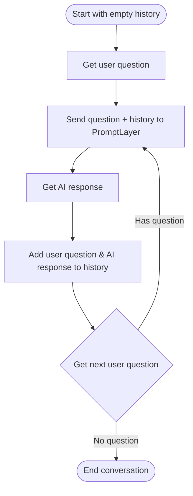
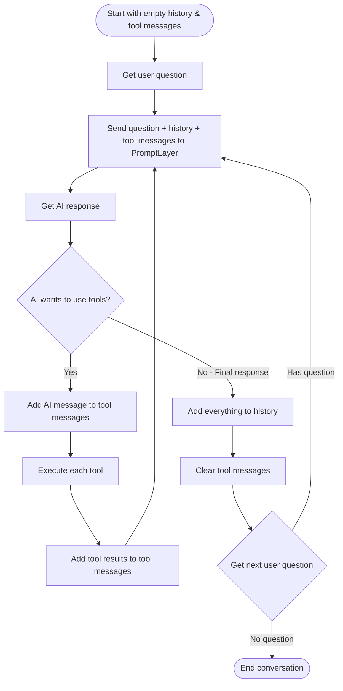

Building reliable conversational AI systems requires careful management of state and conversation history. This guide explains how to implement multi-turn chat using PromptLayer's stateless approach, which enhances reliability and makes your agents easier to test and debug.

## Why Stateless Turns?

Traditional conversational AI systems often maintain complex internal state, making them difficult to debug, test, and scale. The stateless approach treats each turn of the conversation as an independent, deterministic function that receives all necessary context through input variables.

### The Black Box Approach

The best way to build reliable conversational AI is to treat each turn as a black box. You provide inputs (conversation history, current query, available tools) and receive outputs (response, tool calls, next actions). This approach optimizes for rapid development and iteration - you're simply crafting prompts in natural language and validating outputs. By building your conversational system around this principle, you enable quick prompt iterations and fast feedback cycles, which are essential for developing robust multi-turn interactions.

The stateless approach particularly shines when it comes to systematic evaluation of conversation flows. For a deeper dive into evaluating multi-turn conversations, check out our blog post on [best practices for evaluating back-and-forth conversational AI](https://blog.promptlayer.com/best-practi-to-evaluate-back-and-forth-conversational-ai-in-promptlayer/).

## Implementation Pattern

Here's the core pattern for implementing stateless multi-turn chat using [`promptlayer_client.run()`](/running-requests/promptlayer-run):

### Basic Conversation (No Tools)

Maintain a running history of the conversation, adding each exchange as you go.

- Start with empty conversation history
- Loop:
  - Send user question + history to PromptLayer
  - Get AI response
  - Add both to history
  - Get next user question
  - If no more questions, exit loop

<Accordion title="View Flow Diagram">

</Accordion>

<Accordion title="View Python Code">
```python
def run_conversation(user_question):
    chat_history = []

    while True:
        # For basic prompts without tools
        result = promptlayer_client.run(
            prompt_name="multi-turn-assistant",
            input_variables={
                "user_question": user_question,
                "chat_history": chat_history
            },
            tags=["multi-turn-chat"]
        )

        # Extract the assistant's last message
        last_message = result["prompt_blueprint"]["prompt_template"]["messages"][-1]

        # Add to conversation history
        chat_history.append({
            "role": "user",
            "content": [{"type": "text", "text": user_question}]
        })
        chat_history.append(last_message)

        # Get next user input
        user_question = get_next_user_input()
        if not user_question:
            break

    return last_message if 'last_message' in locals() else None
```
</Accordion>

### Conversation with Tools

The AI can make multiple tool calls before responding, accumulating results in a separate message buffer. For a deeper understanding of when and how to use tool calling, check out our blog post on [tool calling with LLMs](https://blog.promptlayer.com/tool-calling-with-llms-how-and-when-to-use-it/).

- Start with empty history and empty tool messages
- Loop:
  - Send user question + history + tool messages to PromptLayer
  - Get AI response
  - If AI wants to use tools:
    - Add AI message to tool messages
    - Execute each tool
    - Add tool results to tool messages
    - Loop back (AI might need more tools)
  - Else (final response):
    - Add everything to history
    - Clear tool messages for next turn
    - Get next user question

<Accordion title="View Flow Diagram">

</Accordion>

<Accordion title="View Python Code">
```python
def run_conversation_with_tools(user_question):
    chat_history = []
    ai_in_progress = []  # Messages from AI's tool interactions

    while True:
        # With tools, include ai_in_progress for multi-step operations
        result = promptlayer_client.run(
            prompt_name="multi-turn-assistant-with-tools",
            input_variables={
                "chat_history": chat_history,
                "user_question": user_question,
                "ai_in_progress": ai_in_progress  # [AI call, tool response, AI call, tool response, ...]
            },
            tags=["multi-turn-chat"]
        )

        last_message = result["prompt_blueprint"]["prompt_template"]["messages"][-1]

        # Check if conversation should end
        function_call = last_message.get("function_call")
        if function_call and function_call.get("name") == "end_conversation":
            return last_message if 'last_message' in locals() else None

        # Handle tool calls - AI might need multiple tool calls before responding
        if last_message.get("tool_calls") or last_message.get("function_call"):
            # Add AI's message with tool call to ai_in_progress
            ai_in_progress.append(last_message)

            # Execute tool and add response
            if last_message.get("tool_calls"):
                for tool_call in last_message["tool_calls"]:
                    tool_result = execute_tool(tool_call)
                    ai_in_progress.append({
                        "role": "tool",
                        "content": [{"type": "text", "text": str(tool_result)}],
                        "tool_call_id": tool_call["id"]
                    })
            elif last_message.get("function_call"):
                tool_result = execute_tool(last_message["function_call"])
                ai_in_progress.append({
                    "role": "function",
                    "name": last_message["function_call"]["name"],
                    "content": str(tool_result)
                })
            # Loop continues - AI can make another tool call or respond to user
        else:
            # AI provided final response - add everything to history
            chat_history.append({
                "role": "user",
                "content": [{"type": "text", "text": user_question}]
            })

            # Add any tool interactions from ai_in_progress to history
            if ai_in_progress:
                chat_history.extend(ai_in_progress)

            # Add final response
            chat_history.append(last_message)

            # Clear ai_in_progress for next user turn
            ai_in_progress = []

            # Get next user input
            user_question = get_next_user_input()
            if not user_question:
                break

    return last_message if 'last_message' in locals() else None
```
</Accordion>

<Note>
You can also implement this pattern using agents for more complex workflows with multiple nodes and conditional logic. See [Running Agents](/running-requests/promptlayer-run-agent) for details on using `promptlayer_client.run_agent()`.
</Note>

## Designing Your Stateless Prompt

Your prompt template should be designed to receive all necessary state through input variables. Here's an example of a properly configured multi-turn assistant with tools:


Notice how the prompt template includes:
- A system message with instructions and tool usage behavior
- Placeholder for `{{chat_history}}` to inject conversation context
- User message with `{{user_question}}`
- Placeholder for `{{ai_in_progress}}` to handle tool interactions

### Required Input Variables

1. **chat_history**: Array of previous messages in the conversation
2. **user_question**: The current user message or query
3. **ai_in_progress**: Array of messages representing ongoing tool interactions (only used with tools, placed AFTER user_question)

### Understanding ai_in_progress

The `ai_in_progress` variable is specifically for handling multi-step tool interactions where the AI needs to make multiple tool calls before responding to the user. It's placed AFTER the user_question because it represents the AI's response to that question. It contains a sequence of messages like:
- AI's tool call (in response to user_question)
- Tool's response
- AI's next tool call
- Tool's response
- Final AI message to user

This allows the AI to perform complex operations (like searching, then filtering, then formatting results) without requiring user input between each step. Once the AI provides a final response, all these messages are moved to chat_history for the next turn. If your prompt doesn't use tools, you can omit this variable entirely.

### Using Message Placeholders

[Message Placeholders](/features/prompt-registry/placeholder-messages) are crucial for injecting conversation context into your prompts. They allow you to dynamically insert the conversation history into your prompt template. For more details on template variables and dynamic prompts, see our [Template Variables](/features/prompt-registry/template-variables) guide:

```python
# In your prompt template, use placeholders:
# Role: placeholder
# Content: {{chat_history}}
#
# Role: user
# Content: {{user_question}}

# For basic conversations without tools:
promptlayer_client.run(
    prompt_name="multi-turn-assistant",
    input_variables={
        "chat_history": [
            {
                "role": "user",
                "content": [{"type": "text", "text": "What's the weather?"}]
            },
            {
                "role": "assistant",
                "content": [{"type": "text", "text": "I'll check the weather for you."}]
            }
        ],
        "user_question": "How about tomorrow?"
    }
)

# For conversations with tools, add ai_in_progress after user_question:
# Role: placeholder
# Content: {{chat_history}}
#
# Role: user
# Content: {{user_question}}
#
# Role: placeholder
# Content: {{ai_in_progress}}
```

## Handling Tool Calls

For agents that use tools, maintain tool state externally. See our [Tool Calling](/features/prompt-registry/tool-calling) documentation for setting up tool definitions in your prompts:

```python
def handle_tool_execution(agent_response, tool_registry):
    """Execute tools and prepare results for next turn"""

    if not agent_response.get("tool_calls"):
        return None

    tool_results = []
    for call in agent_response["tool_calls"]:
        tool = tool_registry.get(call["name"])
        if tool:
            result = tool.execute(call["arguments"])
            tool_results.append({
                "tool": call["name"],
                "call_id": call["id"],
                "result": result
            })

    return tool_results
```

## Integration with Evaluation

The stateless approach makes it easy to evaluate your conversational AI:

1. **Record real conversations** as sequences of inputs and outputs
2. **Replay conversations** with modified parameters to test variations
3. **Evaluate individual turns** for quality and correctness
4. **Test edge cases** by crafting specific conversation states

Learn more about setting up comprehensive evaluations in our [Evaluation and Ranking](/why-promptlayer/evaluation-and-ranking) guide.

## Next Steps

- Explore [Message Placeholders](/features/prompt-registry/placeholder-messages) for dynamic prompt construction
- Set up [Evaluations](/why-promptlayer/evaluation-and-ranking) for your conversational flows
- Learn about [Agent development](/why-promptlayer/agents) for complex workflows
- Read our guide on [Tool Calling](/features/prompt-registry/tool-calling) for implementing tool-enabled assistants
- Check out [Structured Outputs](/features/prompt-registry/structured-outputs) for formatted responses